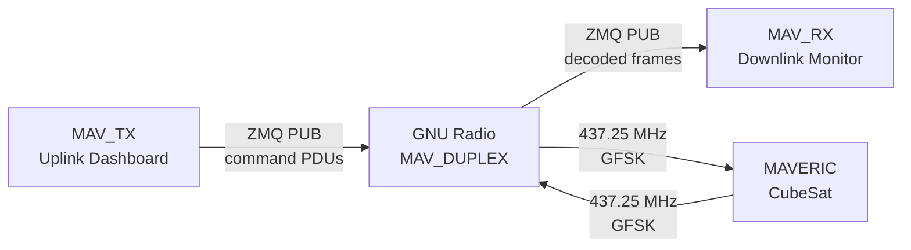
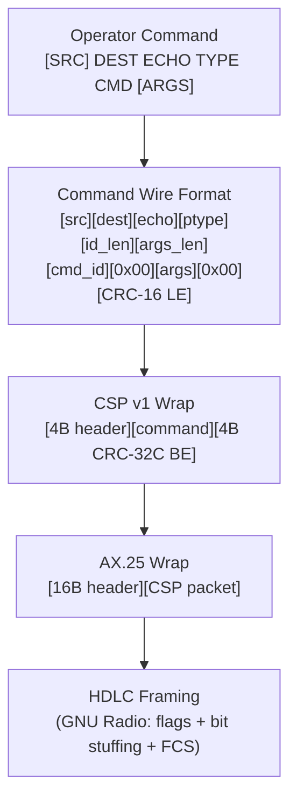

# MAVERIC Ground Station Software

Ground station suite for the MAVERIC CubeSat mission (USC ISI SERC). Provides simultaneous full-duplex uplink/downlink using a single USRP B210 with the GNU Radio MAV_DUPLEX flowgraph.



## Quick Start

Requires the **radioconda** conda environment with GNU Radio 3.10+, gr-satellites, PyZMQ, pmt, crc, pyyaml, and textual.

```bash
conda activate gnuradio

# Start GNU Radio MAV_DUPLEX flowgraph first

python3 MAV_RX.py              # Downlink monitor
python3 MAV_TX.py              # Uplink dashboard
python3 MAV_RX.py --nosplash   # Skip splash screen
```

## Structure

```
MAV_RX.py                 Downlink packet monitor (Textual app)
MAV_TX.py                 Uplink command dashboard (Textual app)

mav_gss_lib/
    protocol.py           Nodes, CSP v1, AX.25, KISS, CRC-16/CRC-32C, command wire format
    transport.py          ZMQ PUB/SUB, PMT PDU send/receive, socket monitoring
    config.py             YAML config loader/saver, AX.25/CSP command handlers
    parsing.py            RX packet processing pipeline (RxPipeline)
    logging.py            Session logging — JSONL + formatted text, background writer thread
    tui_common.py         Shared Textual UI: ConfigScreen modal, HelpPanel, SplashScreen, styles
    tui_rx.py             RX widgets: header, packet list, packet detail
    tui_tx.py             TX widgets: header, queue, sent history, config fields

maveric_gss.yml           Shared config (nodes, AX.25, CSP, ZMQ, frequency)
maveric_commands.yml      Command schema (arg names, types, validation)
maveric_decoder.yml       gr-satellites satellite definition

logs/
    text/                 Human-readable logs (downlink_*.txt, uplink_*.txt)
    json/                 Machine-readable JSONL (downlink_*.jsonl, uplink_*.jsonl)
```

## Protocol Stack



### CSP v1 Header (32-bit big-endian)

```
Bit:  31  30  29    25  24    20  19      14  13     8  7        0
     ├────┤├───────┤├───────┤├─────────┤├────────┤├──────────────┤
     │Pri │  Src   │  Dest  │  DPort   │  SPort  │    Flags     │
     │ 2b │  5b    │  5b    │   6b     │   6b    │     8b       │
     └────┘└───────┘└───────┘└─────────┘└────────┘└──────────────┘
```

### AX.25 SSID Encoding

The GomSpace AX100 radio provides SSID values as raw hex bytes. The encoder accepts both formats:
- **0–15**: Standard SSID value, encoded as `0x60 | (ssid << 1) | ext_bit`
- **>15**: Raw SSID byte from AX100 config, placed directly with managed extension bit

## MAV_RX — Downlink Monitor

Subscribes to ZMQ where GNU Radio publishes decoded PDUs. A background thread receives packets into a queue; the Textual UI drains and displays them at 10Hz.

```
┌──────────────────────────────────────────────┐
│ MAVERIC RX MONITOR              UTC   LOCAL  │
│ ──────────────────────────────────────────── │
│ ZMQ: tcp://...  [LIVE]  Freq: 437.25 MHz    │
│ ZMQ Thread Queue: 0                          │
├──────────────────────────────────────────────┤
│ PACKETS (5)  Auto Scroll: ON                 │
│ #1  12:00:00 AX.25 GS→EPS REQ ping     42B │
│ #2  12:00:01 AX.25 GS→EPS REQ ping     42B │
│ ...                                          │
│ ░  Receiving  5 pkts  3 pkt/min              │
├──────────────────────────────────────────────┤
│ PACKET #2 DETAIL                             │
│ ──────────────────────────────────────────── │
│ CSP V1      Prio:2  Src:0  Dest:8  ...      │
│ CMD         Src:GS  Dest:EPS  Echo:UPPM     │
│ CMD ID      ping                             │
│ CRC-16      0xc315 [OK]                      │
│ ASCII       .ping.ping..                     │
├──────────────────────────────────────────────┤
│ > _                                          │
│ Enter: detail | cfg | help | Ctrl+C: quit    │
└──────────────────────────────────────────────┘
```

**Commands**: `help`, `cfg`, `hex`, `log`, `detail`, `live`, `hclear`, `q`

**Keys**: Up/Down (select packet), PgUp/PgDn (scroll), Enter (toggle detail), Ctrl+C (quit)

**Features**:
- Auto Scroll follows newest packets; selecting a packet exits auto mode
- Uplink echoes tagged `UL` (src=GS or dest/echo not addressed to GS)
- Duplicate detection via CRC-16 + CRC-32C fingerprint (tagged `DUP`)
- Unparseable signals shown as `UNKNOWN` with separate numbering
- Uplink echoes excluded from pkt/min rate
- Hex/ASCII display toggleable; ASCII always shown in detail

## MAV_TX — Uplink Dashboard

Publishes command PDUs via ZMQ to the GNU Radio flowgraph. Commands are queued, then sent asynchronously in a background thread with configurable inter-packet delay.

```
┌──────────────────────────────────────────────┐
│ MAVERIC TX DASHBOARD            UTC   LOCAL  │
│ ──────────────────────────────────────────── │
│ ZMQ: tcp://...  [LIVE]  Freq: 437.25 MHz    │
│ LOG: ON                                      │
├──────────────────────────────────────────────┤
│ TX QUEUE (2)  buf: 2000ms                    │
│  1. GS → EPS  E:UPPM  REQ  ping        12B │
│  2. GS → UPPM E:UPPM  REQ  set_mode    15B │
├──────────────────────────────────────────────┤
│ SENT HISTORY (3)                             │
│ #1  12:00:00  GS → EPS  REQ  ping      20B │
│ ...                                          │
├──────────────────────────────────────────────┤
│ > _                                          │
│ Enter: queue | cfg | help | Ctrl+C: quit     │
└──────────────────────────────────────────────┘
```

**Command format**: `[SRC] DEST ECHO TYPE CMD [ARGS]`

SRC defaults to GS. Examples:
```
EPS UPPM REQ ping
EPS 2 3 1 set_voltage 3.3
```

**Keys**: Ctrl+S (send queue), Ctrl+Z (undo last), Ctrl+X (clear queue), Up/Down (history recall), Ctrl+C/Esc (abort send or quit)

**Commands**: `send`, `undo`/`pop`, `clear`, `hclear`, `cfg`, `help`, `nodes`, `csp`, `ax25`, `raw <hex>`, `q`

**Features**:
- Queue persisted to `.pending_queue.jsonl`, restored on startup
- Async send with abort support (Ctrl+C/Esc during send)
- Config changes saved to `maveric_gss.yml` on exit
- Commands validated against `maveric_commands.yml` schema

## Configuration

### Config Modal

Both apps open a config editor via the `cfg` command. The config screen is a modal overlay with keyboard navigation:

- **↑↓** select field, **Enter** edit (text) or toggle (on/off), **Esc** close and save
- TX config: AX.25 callsigns/SSIDs, CSP parameters, frequency, ZMQ address, TX delay
- RX config: hex display toggle, logging toggle

### maveric_gss.yml

Shared by both apps. TX persists runtime changes on exit.

```yaml
ax25:
  src_call: WM2XBB         # Ground station callsign
  src_ssid: 0x61            # Raw SSID byte (GomSpace AX100)
  dest_call: WS9XSW        # Satellite callsign
  dest_ssid: 0x60

csp:
  priority: 2
  source: 0                 # Ground station CSP address
  destination: 8            # Satellite CSP address
  dest_port: 24
  src_port: 0
  flags: 0

tx:
  zmq_addr: tcp://127.0.0.1:52002
  frequency: 437.25 MHz
  delay_ms: 2000            # Inter-packet delay for queue sends

rx:
  zmq_addr: tcp://127.0.0.1:52001
```

### maveric_commands.yml

Defines argument schemas for known commands. Supported types: `str`, `int`, `float`, `epoch_ms`, `bool`.

- **RX**: parses known commands by position and type (falls back to heuristic for unknown)
- **TX**: validates arguments before queuing; rejects invalid commands with specific errors

## Logging

Both sessions produce paired logs in `logs/text/` and `logs/json/`:

| File | Content |
|------|---------|
| `downlink_YYYYMMDD_HHMMSS.txt` | RX packets — CSP, command routing, CRC, hex dump, flags |
| `downlink_YYYYMMDD_HHMMSS.jsonl` | RX packets — machine-readable |
| `uplink_YYYYMMDD_HHMMSS.txt` | TX commands — routing, AX.25/CSP state, CRC, hex |
| `uplink_YYYYMMDD_HHMMSS.jsonl` | TX commands — machine-readable |

All file I/O runs on a background thread so the UI never blocks on disk writes. RX logging can be toggled at runtime.

## Decoder

`maveric_decoder.yml` configures gr-satellites with three transmitter modes on 437.250 MHz:

- 19k2 FSK AX.25 G3RUH
- 4k8 FSK AX.25 G3RUH
- 4k8 FSK AX100 ASM+Golay

## Dependencies

- [radioconda](https://github.com/ryanvolz/radioconda) (GNU Radio 3.10+, gr-satellites, PyZMQ, pmt)
- [Textual](https://textual.textualize.io/) (`pip install textual`)
- `crc` (`pip install crc`)
- `pyyaml` (`pip install pyyaml`)
