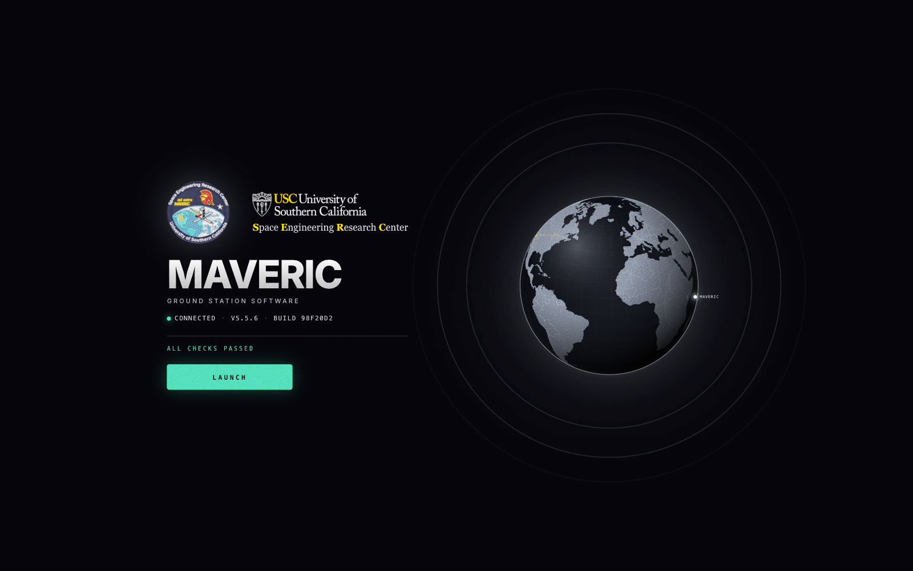
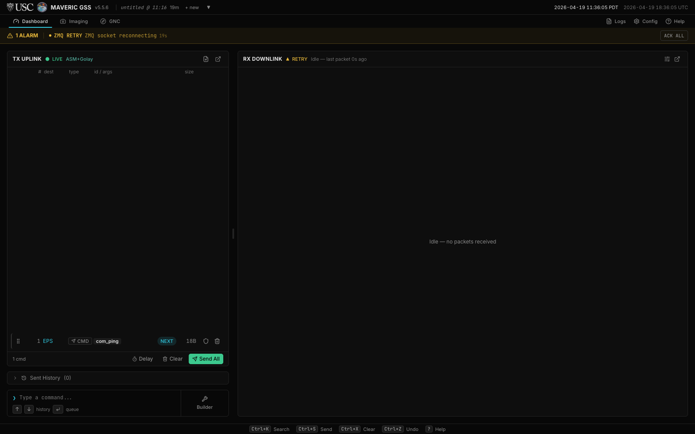
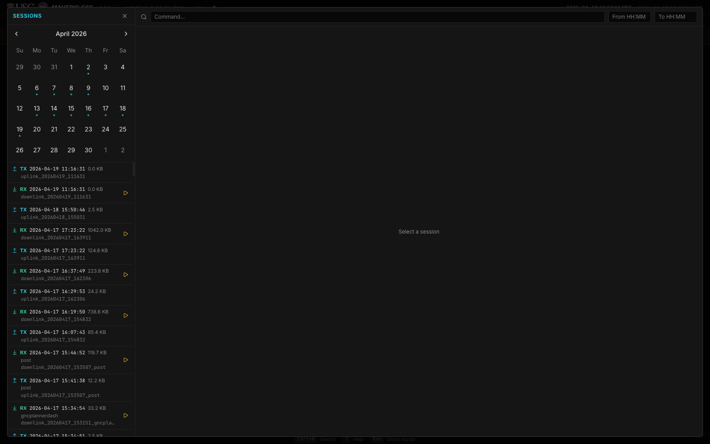
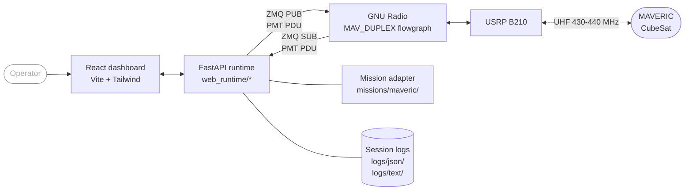
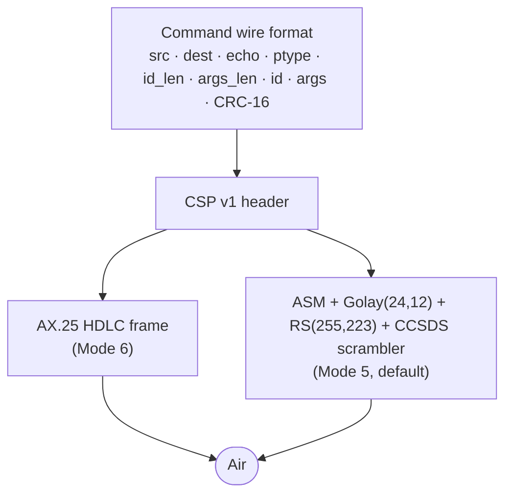

<div align="center">


# MAVERIC Ground Station Software

**Full-duplex ground station for the MAVERIC CubeSat, built at USC SERC.**

[](mav_gss_lib/web/package.json)
[](requirements.txt)
[](https://www.gnuradio.org/)
[](mav_gss_lib/web/package.json)
[](https://fastapi.tiangolo.com/)
[](#protocol-stack)

[Quickstart](#quickstart) · [Features](#features) · [Architecture](#architecture) · [Documentation](#documentation) · [About MAVERIC](#about-maveric)



</div>

---

## Contents

- [Overview](#overview)
- [Features](#features)
- [Gallery](#gallery)
- [Quickstart](#quickstart)
- [Requirements](#requirements)
- [Run](#run)
- [Architecture](#architecture)
- [Protocol stack](#protocol-stack)
- [Uplink modes](#uplink-modes)
- [Repository layout](#repository-layout)
- [Configuration](#configuration)
- [Mission contract](#mission-contract)
- [Web UI development](#web-ui-development)
- [Testing](#testing)
- [Documentation](#documentation)
- [About MAVERIC](#about-maveric)
- [Citation](#citation)
- [Acknowledgements](#acknowledgements)

---

## Overview

MAVERIC GSS is the ground station software for the MAVERIC CubeSat mission, developed at the University of Southern California Space Engineering Research Center (SERC). It performs simultaneous full-duplex uplink and downlink through a single USRP B210 radio driven by GNU Radio, and presents a web-based operator console for command composition, live telemetry, imaging, and GNC monitoring.

The platform is mission-agnostic. Transport, queue, logging, protocol toolkit, and the web UI shell are reusable. Mission-specific parsing, command encoding, and operator rendering live in pluggable mission packages under `mav_gss_lib/missions/`. MAVERIC is the first and default mission package; additional missions drop in without platform changes.

## Features

- **Single-radio full-duplex** — one USRP B210 handles uplink and downlink concurrently via the `MAV_DUPLEX` GNU Radio flowgraph.
- **Two uplink framings** — operator-selectable `AX.25` (Mode 6, HDLC + G3RUH) or `ASM+Golay` (Mode 5, CCSDS + Reed-Solomon FEC).
- **Mission-agnostic core** — swap the mission package to retarget the platform; the adapter contract is enforced at startup.
- **Drag-to-reorder command queue** with delay and note items, JSONL import/export, guard confirmation, and persistent recovery after restart.
- **Live session logs** — dual JSONL and human-readable text, per-session files under `logs/json/` and `logs/text/`.
- **Session replay** — browse and re-play any past session in the Log Viewer.
- **GNC dashboard** — attitude, navigation, and control telemetry with staleness tracking for pass-cadence updates.
- **Imaging plugin** — chunked downlink reassembly, thumbnail previews, and delete.
- **Plugin system** — mission packages can register their own FastAPI routers and React plugin pages.
- **NASA HFDS-compliant console** — minimum 11 px text, ≥3:1 contrast, color redundancy via icon and text, 3/4/5 Hz alarm flash rates.
- **Preflight screen** — dependencies, GNU Radio, config, web build, and ZMQ connectivity verified before operator launch.

## Gallery

<table>
<tr>
<td width="50%"><strong>Main dashboard</strong><br/><sub>TX uplink queue (left) + RX downlink stream (right)</sub><br/><br/></td>
<td width="50%"><strong>Log viewer</strong><br/><sub>Calendar, session list, filter, replay</sub><br/><br/></td>
</tr>
</table>

## Quickstart

```bash
conda activate                                                                     # radioconda base env
cp mav_gss_lib/gss.example.yml mav_gss_lib/gss.yml                                 # first run only
cp mav_gss_lib/missions/maveric/commands.example.yml mav_gss_lib/missions/maveric/commands.yml
python3 MAV_WEB.py
```

The dashboard opens in the default browser at `http://127.0.0.1:8080`. The server exits about two seconds after the last browser tab closes.

For live uplink and downlink, start the `MAV_DUPLEX` GNU Radio flowgraph before launching `MAV_WEB.py`.

## Requirements

| Component | Minimum | Recommended | Notes |
|---|---|---|---|
| OS | macOS or Linux | Linux x86_64 / arm64 | Tested on macOS 15 and Ubuntu 22.04 |
| Python | 3.10 | 3.11 | Provided by radioconda |
| GNU Radio | 3.10 | 3.10 with gr-satellites | Supplies `pmt` and the flowgraph runtime |
| Node.js | — | 20 LTS | Only needed when rebuilding the UI |
| Radio | — | Ettus USRP B210 | Required for live RF; simulation and replay do not need hardware |
| Browser | Any modern Chromium/Firefox | Chrome / Edge | The dashboard is pure SPA; no extensions needed |

Python packages (`requirements.txt`): `fastapi`, `uvicorn`, `websockets`, `PyYAML`, `pyzmq`, `crcmod`, `Pillow`. `pmt` is provided by the local GNU Radio install.

## Run

```bash
conda activate                     # radioconda base env
cp mav_gss_lib/gss.example.yml mav_gss_lib/gss.yml                                   # first run only
cp mav_gss_lib/missions/maveric/commands.example.yml mav_gss_lib/missions/maveric/commands.yml  # first run only
python3 MAV_WEB.py
```

`MAV_WEB.py` serves the dashboard on `http://127.0.0.1:8080` (constants in `mav_gss_lib/web_runtime/state.py`) and auto-opens the default browser. The server exits roughly two seconds after the last RX and TX WebSocket client disconnects (`SHUTDOWN_DELAY` in `mav_gss_lib/web_runtime/shutdown.py`).

The GNU Radio flowgraph must be running before launching `MAV_WEB.py`. The runtime connects to it with two ZMQ sockets:

| Direction | Socket  | Default address         | Role                                 |
|-----------|---------|-------------------------|--------------------------------------|
| RX        | ZMQ SUB | `tcp://127.0.0.1:52001` | Receives decoded PDUs from GNU Radio |
| TX        | ZMQ PUB | `tcp://127.0.0.1:52002` | Publishes framed uplink payloads     |

Both addresses are editable in `gss.yml`. PDUs use PMT serialization for GNU Radio interop.

A quick runtime probe once the server is up:

```bash
curl http://127.0.0.1:8080/api/selfcheck
```

A standalone pre-launch environment check is available at `scripts/preflight.py`:

```bash
python3 scripts/preflight.py
```

It reports pass/fail for Python dependencies, GNU Radio and PMT availability, config files, web build, and ZMQ addresses.

## Architecture

The platform sits between the operator and GNU Radio. RX traffic arrives as PMT-serialized PDUs over ZMQ SUB, passes through the active mission adapter for parsing and rendering, and is broadcast to browser clients over `/ws/rx`. TX commands flow in the reverse direction: the UI submits payloads over `/ws/tx`, the mission adapter validates and encodes them, the platform frames them (AX.25 or ASM+Golay), and the result is published to GNU Radio over ZMQ PUB.



Top-level platform modules:

| Module                           | Role                                                                 |
|----------------------------------|----------------------------------------------------------------------|
| `MAV_WEB.py`                     | Entrypoint. Bootstraps dependencies, builds the FastAPI app, runs Uvicorn. |
| `mav_gss_lib/config.py`          | Loads `gss.yml`, deep-merges over defaults, provides config helpers. Single-sources `general.version` from `mav_gss_lib/web/package.json`. |
| `mav_gss_lib/mission_adapter.py` | `MissionAdapter` Protocol, `ParsedPacket`, adapter loader. |
| `mav_gss_lib/parsing.py`         | `Packet` dataclass and `RxPipeline` (frame detect, normalize, dedupe, rate). |
| `mav_gss_lib/transport.py`       | ZMQ PUB/SUB setup, PMT PDU send/receive, socket monitoring. |
| `mav_gss_lib/logging.py`         | Dual-output session logging (JSONL + formatted text). |
| `mav_gss_lib/updater.py`         | Runtime dependency bootstrap and self-update flow. |
| `mav_gss_lib/preflight.py`       | Environment-check backend used by `scripts/preflight.py` and the web preflight screen. |
| `mav_gss_lib/constants.py`       | Platform string constants (default mission, default ZMQ addresses). |
| `mav_gss_lib/textutil.py`        | Text formatting helpers. |

Web runtime (`mav_gss_lib/web_runtime/`):

| Module                | Role                                                                  |
|-----------------------|-----------------------------------------------------------------------|
| `app.py`              | FastAPI factory, lifespan, static mount, mission plugin router mount. |
| `state.py`            | `WebRuntime` container, `HOST`, `PORT`, `MAX_PACKETS`, `MAX_HISTORY`, `MAX_QUEUE`, `Session`. |
| `shutdown.py`         | `SHUTDOWN_DELAY`, delayed-shutdown task scheduling.                   |
| `rx_service.py`       | ZMQ SUB receiver thread and async broadcast loop.                     |
| `tx_service.py`       | TX queue, send loop, history, persistence, guard confirmation.        |
| `tx_queue.py`         | Pure queue helpers (build, validate, sanitize, save/load JSONL).      |
| `tx_actions.py`       | Queue mutation actions invoked by the `/ws/tx` handler.               |
| `tx_context.py`       | Send-context snapshot helper.                                         |
| `rx.py` / `tx.py`     | `/ws/rx` and `/ws/tx` WebSocket handlers.                             |
| `session_ws.py`       | `/ws/session` WebSocket.                                              |
| `preflight_ws.py`     | `/ws/preflight` WebSocket and preflight broadcast loop.               |
| `update_ws.py`        | Update-check scheduling and WebSocket.                                |
| `security.py`         | CORS / CSP headers / API-token check.                                 |
| `api/`                | REST routers: `config.py`, `schema.py`, `logs.py`, `queue_io.py`, `session.py`. |
| `_atomics.py`         | `AtomicStatus` primitive.                                             |
| `_broadcast.py`       | `broadcast_safe` WebSocket helper.                                    |
| `_task_utils.py`      | Task exception logging.                                               |
| `_ws_utils.py`        | Shared WebSocket utilities.                                           |

## Protocol stack

Frames layer outward from the command payload to the air interface:



Supported argument types in the command schema: `str`, `int`, `float`, `epoch_ms`, `bool`, `blob`. Uplink framing is selected by `tx.uplink_mode` in `gss.yml`.

## Uplink modes

| Property | `AX.25` (Mode 6) | `ASM+Golay` (Mode 5, default) |
|---|---|---|
| Encoding | NRZI, LSB first | NRZ, MSB first |
| Line coding | G3RUH scrambler | CCSDS scrambler |
| Framing | HDLC flag + 16-byte AX.25 header | 32-bit ASM + Golay(24,12) length + RS(255,223) |
| FEC | None | Reed-Solomon (corrects up to 16 byte errors per frame) |
| Approx throughput at 9k6 | 985 B/s | 796 B/s |
| Frame structure | Variable | `[50B preamble][4B ASM][3B Golay][scrambled RS codeword][pad to 255B]` |
| Payload limit (post-CSP) | HDLC-bound | 223 bytes |

Mode 5 is the recommended default: FEC materially improves pass yield at the cost of modest throughput.

## Repository layout

```text
MAV_WEB.py                          Web runtime entrypoint
requirements.txt                    Backend Python dependencies

mav_gss_lib/
    config.py                       Config loader
    constants.py                    Platform-wide constants
    mission_adapter.py              MissionAdapter Protocol + loader
    parsing.py                      Packet + RxPipeline
    transport.py                    ZMQ PUB/SUB + PMT PDU
    logging.py                      Session logs (JSONL + text)
    preflight.py                    Environment checks
    updater.py                      Self-update bootstrap
    textutil.py                     Text helpers
    gss.example.yml                 Public-safe station config template
    protocols/
        ax25.py                     AX.25 HDLC framing (Mode 6)
        csp.py                      CSP v1 header + KISS framing
        crc.py                      CRC-16 XMODEM, CRC-32C
        golay.py                    ASM+Golay framing (Mode 5)
        frame_detect.py             Frame type detection
    missions/
        template/                   Minimal starter mission package
        maveric/                    MAVERIC mission package
            __init__.py             ADAPTER_API_VERSION, ADAPTER_CLASS,
                                    init_mission, get_plugin_routers
            adapter.py              MavericMissionAdapter
            nodes.py                NodeTable + init_nodes
            wire_format.py          CommandFrame encode/decode
            schema.py               Command schema loader/validator
            cmd_parser.py           TX command-line parser
            rx_ops.py               RX packet parsing
            tx_ops.py               TX command building
            rendering.py            RX display slots
            display_helpers.py      Rendering helpers
            log_format.py           Mission-specific log record fields
            imaging.py              Image chunk reassembly + /api/plugins/imaging router
            telemetry/              Telemetry decoders, GNC register store, GNC router
            mission.example.yml     Tracked public-safe mission metadata
            commands.example.yml    Tracked public-safe command schema
    web/                            React + Vite frontend
        src/                        UI source
        dist/                       Production build (committed)
        package.json                Frontend deps + version (single source of truth)
    web_runtime/                    FastAPI runtime (see table above)

tests/                              unittest suite
docs/                               Architecture + maintainer docs + images
scripts/
    preflight.py                    Standalone preflight runner
    preview_eps_hk.py               EPS telemetry preview helper
```

## Configuration

Three config inputs drive the runtime:

- `mav_gss_lib/gss.yml` — operator station config: ZMQ addresses, log directory, TX delay, uplink mode, AX.25 and CSP parameters, mission selection. Gitignored. Copy from `mav_gss_lib/gss.example.yml`. If the file is missing, the runtime falls back to built-in defaults.
- `mav_gss_lib/missions/<name>/mission.example.yml` — tracked, public-safe mission metadata: nodes, ptypes, AX.25 callsigns, CSP defaults, UI titles. The runtime prefers a local `mission.yml` beside it when present. `mission.yml` is gitignored.
- `mav_gss_lib/missions/<name>/commands.example.yml` — tracked, public-safe command schema template documenting `tx_args` and `rx_args`. The operational `commands.yml` is gitignored for security and must be supplied locally. Without it the server starts but cannot validate or send commands.

Version is single-sourced from `mav_gss_lib/web/package.json` via `config.py::_read_version()`. `gss.yml` cannot pin a version — the `/api/config` save path strips any client-supplied `general.version`.

Also gitignored: `logs/`, `images/`, `generated_commands/`, `.pending_queue.jsonl`, `.gnc_snapshot.json`, `node_modules/`.

## Mission contract

A mission is a Python package at `mav_gss_lib/missions/<name>/` exporting:

- `ADAPTER_API_VERSION = 1`
- `ADAPTER_CLASS` — a class satisfying the `MissionAdapter` Protocol in `mav_gss_lib/mission_adapter.py`
- `init_mission(cfg) -> dict` — one-time setup hook called after metadata merge; returns a dict that seeds the adapter (for example `cmd_defs`, `nodes`, `image_assembler`, `gnc_store`)
- `get_plugin_routers(adapter, config_accessor)` — optional; returns FastAPI routers auto-mounted by `web_runtime/app.py`

Set `general.mission` in `gss.yml` to select the active package. The default is `maveric`. A minimal starter lives at `mav_gss_lib/missions/template/`. See `docs/adding-a-mission.md` and `docs/plugin-system.md` for the full contract.

## Web UI development

The production build at `mav_gss_lib/web/dist/` is committed so running the server does not require Node. When modifying UI source under `mav_gss_lib/web/src/`:

```bash
cd mav_gss_lib/web
npm install             # first time only
npm run dev             # Vite dev server with HMR, proxies API to :8080
npm run build           # production build; commit dist/ alongside source changes
```

The backend (`python3 MAV_WEB.py`) must be running while `npm run dev` is used so API and WebSocket requests can proxy to port 8080. Rebuild `dist/` and commit it whenever UI source changes so the served frontend stays in sync.

## Testing

The test suite under `tests/` uses `unittest` and runs under the radioconda environment. Run individual files directly:

```bash
conda activate
cd tests
python3 test_ops_protocol_core.py       # protocol + mission-adapter seam
python3 test_ops_rx_pipeline.py         # RX pipeline and duplicate detection
python3 test_ops_logging.py             # session logging + replay
python3 test_tx_plugin.py               # TX plugin contract
python3 test_ops_web_runtime.py         # web runtime wiring
```

One end-to-end GNU Radio test is opt-in and requires the full gr-satellites flowgraph:

```bash
MAVERIC_FULL_GR=1 python3 tests/test_ops_golay_path.py
```

## Documentation

| Doc | Audience | What it covers |
|---|---|---|
| [`docs/maintainer_handoff.md`](docs/maintainer_handoff.md) | Maintainer | Boot path, required files, config structure, adapter contract, repo map, sensitive surfaces. |
| [`docs/adding-a-mission.md`](docs/adding-a-mission.md) | Mission author | Step-by-step guide for a new mission package. |
| [`docs/plugin-system.md`](docs/plugin-system.md) | Mission author | Plugin pages and FastAPI routers beyond core RX/TX. |
| [`docs/gnc-migration.md`](docs/gnc-migration.md) | Frontend author | GNC dashboard registers, measurements, and migration status. |
| [`docs/mission-help-contract.md`](docs/mission-help-contract.md) | Architect | Proposal for mission-provided command-entry help. |

## About MAVERIC

MAVERIC is a science-and-technology CubeSat designed and built by students at the University of Southern California Space Engineering Research Center (SERC). It tests magnetics in orbit and carries two technology payloads demonstrating 2D and 3D visualization from an LCD screen for space applications.

- **Mission site:** <https://www.isi.edu/centers-serc/research/nanosatellites/maveric/>
- **Organization:** USC Space Engineering Research Center (SERC), Information Sciences Institute (ISI)

This repository is the operator-facing ground segment software — command entry, queueing, framing, transmission over a software-defined radio, and reception, decoding, logging, and display of downlink telemetry.

## Citation

If you use or reference this software in academic work, please cite:

```bibtex
@software{maveric_gss,
  title        = {MAVERIC Ground Station Software},
  author       = {Annuar, Irfan},
  organization = {USC Space Engineering Research Center, University of Southern California},
  year         = {2026},
  url          = {https://www.isi.edu/centers-serc/research/nanosatellites/maveric/}
}
```

## Acknowledgements

- [GNU Radio](https://www.gnuradio.org/) and the `gr-satellites` community for the RF signal chain.
- Ettus Research / NI for the [USRP B210](https://www.ettus.com/all-products/ub210-kit/).
- GomSpace for the [NanoCom AX100](https://gomspace.com/shop/subsystems/communication-systems/nanocom-ax100.aspx) transceiver specification used on orbit.
- The NASA Human Factors Design Standard (NASA-STD-3001 / HFDS) for operator-console guidance.
- The USC SERC MAVERIC team, past and present.
