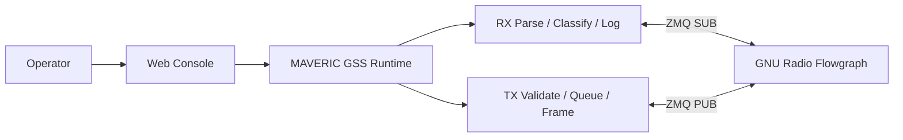
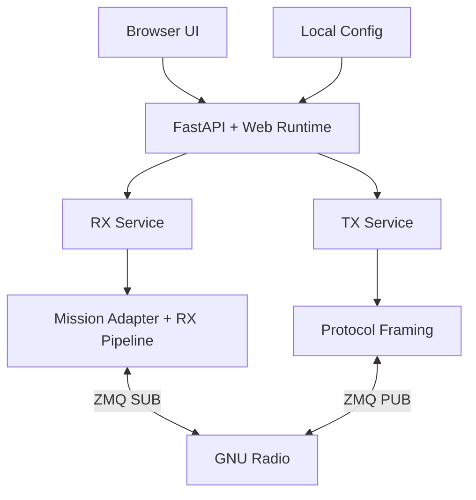

# MAVERIC Ground Station Software

MAVERIC Ground Station Software is the ground-station runtime and operator console for the **MAVERIC CubeSat**, developed at the **University of Southern California (USC)** through the **Space Engineering Research Center (SERC)**.

It is a web-based system for live telemetry monitoring, command uplink operations, and operator-facing session control across the full ground-station workflow.

This repository is public-facing by design: the implementation is visible, the architecture is documented, and the operationally sensitive mission-specific files stay local.

## Ground Segment at a Glance

- **Mission Role:** ground-station runtime for the MAVERIC CubeSat
- **Institutional Context:** developed at USC through SERC
- **Primary Interface:** browser-based operator console (FastAPI + React)
- **Core Functions:** receive telemetry, review packets, validate commands, execute uplink queues, record sessions
- **System Position:** operational layer between GNU Radio and the operator

---

## System Architecture



MAVERIC GSS sits between the operator and GNU Radio. It receives decoded traffic over a ZMQ SUB socket, parses and classifies packets through a mission adapter, and exposes live state to browser clients over WebSocket. Outbound commands are validated against a local schema, framed for the selected uplink mode, and published to GNU Radio over a ZMQ PUB socket.

### Layers

1. **Browser UI** — React SPA for live RX/TX work
2. **Web Runtime** — FastAPI backend: REST API, WebSocket endpoints, queue control, session management
3. **Shared Library** — Protocol support, mission adapter, transport helpers, logging
4. **Radio Integration** — GNU Radio flowgraph connected via ZMQ



---

## Boot Sequence

When `python3 MAV_WEB.py` runs:

1. `load_gss_config()` reads `mav_gss_lib/gss.yml` and merges with hardcoded defaults
2. `create_app()` instantiates `WebRuntime`:
   - Loads mission adapter via `load_mission_adapter(cfg)` — reads `mission.yml` or `mission.example.yml`, calls `init_mission()`, instantiates the adapter
   - Creates CSP/AX.25 protocol objects from merged config
   - Creates RX and TX services
3. FastAPI lifespan startup:
   - Loads persisted TX queue from `.pending_queue.jsonl`
   - Initializes ZMQ PUB socket for TX
   - Creates RX and TX session logs
   - Starts RX receiver thread (ZMQ SUB) and async broadcast loop
4. Uvicorn serves on `127.0.0.1:8080`, browser auto-opens

### GNU Radio Connection

The flowgraph must already be running before launching MAV_WEB. MAVERIC GSS connects to it via two ZMQ sockets:

| Direction | Socket | Default Address | Role |
|-----------|--------|-----------------|------|
| RX | ZMQ SUB | `tcp://127.0.0.1:52001` | Receives decoded PDUs from GNU Radio |
| TX | ZMQ PUB | `tcp://127.0.0.1:52002` | Publishes framed uplink payloads to GNU Radio |

Both addresses are configurable in `gss.yml`. PDUs use PMT serialization for GNU Radio interop.

---

## Required Local Files

These files are **gitignored** and must exist locally for the system to run:

| File | Location | Purpose |
|------|----------|---------|
| `gss.yml` | `mav_gss_lib/gss.yml` | Station config: ZMQ addresses, log directory, version |
| `commands.yml` | `mav_gss_lib/missions/maveric/commands.yml` | Command schema (gitignored for security) |
| `mission.yml` | `mav_gss_lib/missions/maveric/mission.yml` | Optional local/private mission metadata override |

Copy from examples to get started:

```bash
cp mav_gss_lib/gss.example.yml mav_gss_lib/gss.yml
```

The repository tracks `mission.example.yml` as the public-safe MAVERIC metadata baseline. If a local `mission.yml` exists beside it, the runtime prefers that local file.

The command schema (`commands.yml`) must be obtained separately — it is not included in the public repository for operational security reasons.

If `gss.yml` is missing, the system falls back to hardcoded defaults. If `commands.yml` is missing, the system starts but cannot validate or send commands.

---

## Startup

```bash
conda activate radioconda
pip install -r requirements.txt
cp mav_gss_lib/gss.example.yml mav_gss_lib/gss.yml
python3 MAV_WEB.py
```

The web UI build (`mav_gss_lib/web/dist/`) is committed to the repo — no build step needed for deployment. For UI development, run `npm install && npm run dev` in `mav_gss_lib/web/`.

The web UI auto-opens at `http://127.0.0.1:8080`. The server shuts down 15 seconds after all browser tabs disconnect.

### Web UI Development

```bash
cd mav_gss_lib/web
npm run dev           # Vite dev server with HMR (proxies API to :8080)
npm run build         # Production build to dist/
```

### Self-Check

After starting the server, visit `/api/selfcheck` to verify the runtime environment:

```bash
curl http://127.0.0.1:8080/api/selfcheck
```

Reports active mission, resolved config/schema paths, web build status, and ZMQ endpoints.

---

## What It Delivers

### Live Downlink Operations

- Real-time packet visibility with parsed routing and command detail
- Duplicate detection and uplink-echo tagging
- Stale-link and health indicators
- Local RX session logging (JSONL + formatted text)

### Controlled Uplink Operations

- Schema-validated command entry with visual command builder
- Persistent TX queue with drag-and-drop reorder
- Delay items and guard confirmations
- Two uplink modes: AX.25 (Mode 6) and ASM+Golay (Mode 5, recommended)
- Local TX session logging

### Operator Workflow

- Browser-based split RX/TX console
- Log replay and session review
- Runtime config editing
- Keyboard-driven controls (Ctrl+K command palette)

---

## Codebase Layout

```text
MAV_WEB.py                      Web runtime entrypoint

mav_gss_lib/
    config.py                   Config loader (gss.yml + defaults)
    mission_adapter.py          Mission adapter protocol + loader
    parsing.py                  RX pipeline: Packet dataclass, duplicate tracking
    logging.py                  Dual-output session logging (JSONL + text)
    transport.py                ZMQ PUB/SUB setup, PMT PDU helpers
    textutil.py                 Text formatting utilities

    protocols/
        ax25.py                 AX.25 HDLC framing (Mode 6)
        csp.py                  CSP v1 header build/parse, KISS framing
        crc.py                  CRC-16 XMODEM, CRC-32C
        golay.py                ASM+Golay framing (AX100 Mode 5)
        frame_detect.py         Frame type detection and normalization

    missions/
        maveric/
            __init__.py          Mission entry point (API version, init hook)
            adapter.py           MavericMissionAdapter (parse, render, encode)
            wire_format.py       Command wire format, schema, node tables
            mission.example.yml  Tracked public-safe mission metadata baseline
            mission.yml          Optional local mission metadata override
            commands.yml         Command schema (gitignored)
            imaging.py           Image chunk reassembly

    web/
        package.json
        src/                    React + Vite + Tailwind + shadcn/ui
        dist/                   Production build (committed)

    web_runtime/
        app.py                  FastAPI factory + lifespan
        state.py                WebRuntime container
        runtime.py              Queue/TX helpers
        api.py                  REST API routes
        rx.py                   RX WebSocket handler
        tx.py                   TX WebSocket handler
        services.py             RxService + TxService
        security.py             Session token validation

tests/                          Test suite (pytest)
    echo_mission.py             Example non-MAVERIC adapter for testing
```

---

## Mission Adapter Boundary

The system is structured around a **mission adapter** that owns all mission-specific semantics:

- Frame classification and normalization
- Inner packet parsing (CSP, command wire format)
- Integrity checks (CRC-16, CRC-32C)
- Duplicate fingerprinting and uplink-echo classification
- TX command encoding and argument validation
- UI rendering: column definitions, detail blocks, protocol blocks
- Log serialization

The platform (transport, runtime, UI shell, logging) is mission-agnostic. The MAVERIC mission is implemented as one package under `mav_gss_lib/missions/maveric/`. A second adapter (`tests/echo_mission.py`) proves the boundary works.

For a future SERC mission:

1. Create a new mission package under `mav_gss_lib/missions/<name>/`
2. Provide `__init__.py` (with `ADAPTER_API_VERSION`, `ADAPTER_CLASS`, `init_mission`), `mission.example.yml`, `adapter.py`, and `commands.yml`
3. Set `general.mission` in `gss.yml` to the package name
4. Leave transport, runtime, logging, and UI code unchanged

Mission packages are discovered by convention — any package at `mav_gss_lib.missions.<name>` is automatically found. No platform registration needed.

See `mav_gss_lib/missions/template/` for a minimal starting point and `docs/maintainer_handoff.md` for the full contract.

---

## Testing

```bash
conda activate radioconda
pytest -q
```

One end-to-end GNU Radio test is opt-in (requires full gr-satellites environment):

```bash
MAVERIC_FULL_GR=1 pytest -q -rs tests/test_ops_golay_path.py
```

---

## Public Repository Policy

**Tracked in git:**
source code, web UI, public-safe examples, documentation

**Kept local and untracked:**
`gss.yml`, `commands.yml`, logs, generated command files, `.pending_queue.jsonl`

---

## Documentation

- `docs/maintainer_handoff.md` — Boot path, required files, config structure, mission contract, adaptation guide
- `docs/superpowers/plans/2026-04-06-mission-decoupled-platform-spec.md` — Platform/mission separation architecture spec
- `docs/adding-a-mission.md` — Guide for adding a new mission package
