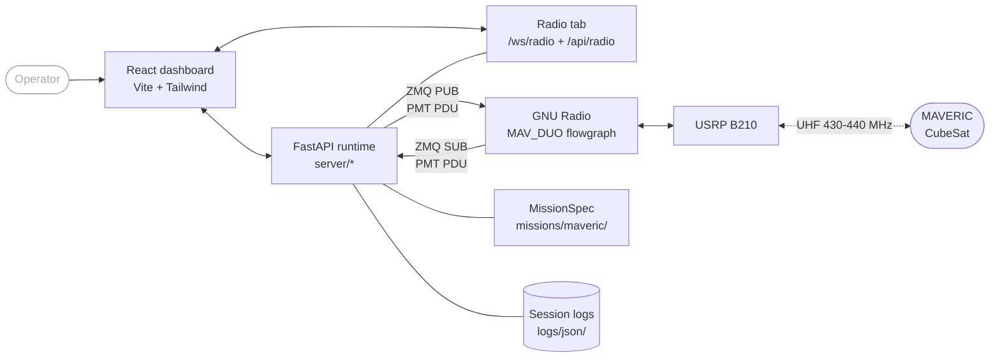
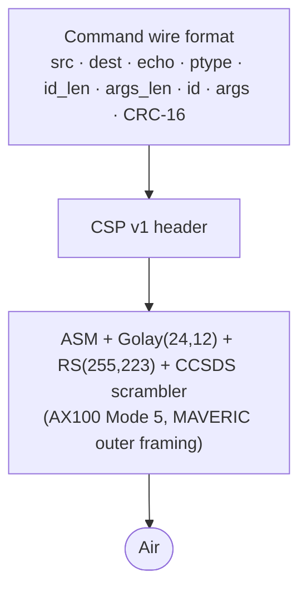

<div align="center">


# MAVERIC Ground Station Software

**Full-duplex-capable ground station for the MAVERIC CubeSat, built at USC SERC.**

[](mav_gss_lib/web/package.json)
[](requirements.txt)
[](https://www.gnuradio.org/)
[](mav_gss_lib/web/package.json)
[](https://fastapi.tiangolo.com/)
[](#protocol-stack)

[Quickstart](#quickstart) · [Features](#features) · [Architecture](#architecture) · [About MAVERIC](#about-maveric)

</div>

---

## Contents

- [Overview](#overview)
- [Features](#features)
- [Quickstart](#quickstart)
- [Requirements](#requirements)
- [Run](#run)
- [Architecture](#architecture)
- [Protocol stack](#protocol-stack)
- [Supported framing modes](#supported-framing-modes)
- [Repository layout](#repository-layout)
- [Logging](#logging)
- [Configuration](#configuration)
- [Mission contract](#mission-contract)
- [Web UI development](#web-ui-development)
- [Testing](#testing)
- [About MAVERIC](#about-maveric)
- [Citation](#citation)
- [Acknowledgements](#acknowledgements)

---

## Overview

MAVERIC GSS is the ground station software for the MAVERIC CubeSat mission, developed at the University of Southern California Space Engineering Research Center (SERC). The software and radio stack are full-duplex capable — a single USRP B210 driven by GNU Radio handles both uplink and downlink channels — and the operational ground station runs half-duplex over a single UHF antenna using a coax switch to alternate between transmit and receive. The platform presents a web-based operator console for command composition, live telemetry, imaging, and GNC monitoring.

The platform is mission-agnostic. Transport, queueing, logging, protocol primitives, the XTCE-lite runtime, alarms, and the web UI shell are reusable. Mission packages under `mav_gss_lib/missions/` provide packet parsing, command encoding/framing, mission facts, event sources, HTTP routers, and optional plugin pages. MAVERIC is the default mission package; fixture missions (`echo_v2`, `balloon_v2`) exercise the boundary.

## Features

- **Single-radio, full-duplex capable** — one USRP B210 drives both uplink and downlink channels via the `MAV_DUO` GNU Radio flowgraph. The deployed station operates half-duplex over a single UHF antenna switched between TX and RX by a coax switch.
- **Declarative wire framing** — mission packages declare uplink chains in `mission.yml`, and the platform `DeclarativeFramer` composes registered framers (`csp_v1`, `ax25`, `asm_golay`) at send time. MAVERIC's operational chain is CSP v1 → ASM+Golay, while AX.25 / HDLC / G3RUH support remains available for missions or test profiles that use AX100 Mode 6-style framing.
- **Mission-agnostic core** — swap the mission package to retarget the platform; a single `MissionSpec` contract (packets / commands / events / HTTP / config / preflight) is enforced at load time.
- **Drag-to-reorder command queue** with command, delay, note, and manual checkpoint items, JSONL import/export, guard confirmation, verification-window admission gates, and persistent recovery after restart.
- **Radio supervisor** — optional backend-managed GNU Radio process control for `gnuradio/MAV_DUO.py`, with `/api/radio/*`, `/ws/radio`, stdout/stderr fan-out, and a built-in Radio tab.
- **Unified session logs** — one per-session JSONL stream under `logs/json/` for RX packets, TX commands, parameter rows, verifier events, and alarm audit records, plus an accepted-RX binary ingest journal under `<log_dir>/rx/`.
- **Log browser** — browse past session JSONL files, filter RX/TX entries, and fetch parameter rows without replaying RF.
- **Telemetry dashboards** — EPS and GNC plugin pages consume values decoded by the declarative XTCE-lite walker and stored in the platform `ParameterCache`.
- **Unified alarm bus** — platform health, container freshness, and parameter-rule alarms in a single 4-state machine (`/ws/alarms`), with audit trail in the session log.
- **Imaging plugin** — source-scoped chunked downlink reassembly, paired full/thumbnail progress, previews, and delete.
- **Plugin system** — mission packages can register their own FastAPI routers and React plugin pages.
- **HFDS-informed console design** — dark operator theme, semantic color redundancy, alarm flash-rate targets, and an 11 px minimum text target for new UI work.
- **Preflight screen** — dependencies, GNU Radio, config, web build, and ZMQ connectivity verified before operator launch.

## Quickstart

```bash
conda activate                                                                     # radioconda base env
cp mav_gss_lib/gss.example.yml mav_gss_lib/gss.yml                                 # first run only
cp mav_gss_lib/missions/maveric/mission.example.yml mav_gss_lib/missions/maveric/mission.yml
python3 MAV_WEB.py
```

The dashboard opens in the default browser at `http://127.0.0.1:8080`. The server exits about two seconds after the last browser tab closes.

For live uplink and downlink, either start the `MAV_DUO` GNU Radio flowgraph yourself or use the dashboard's Radio tab to start the configured `platform.radio.script` (`gnuradio/MAV_DUO.py` by default). Set `platform.radio.autostart: true` in `gss.yml` only when the station should launch the flowgraph automatically with the web runtime.

## Requirements

| Component | Minimum | Recommended | Notes |
|---|---|---|---|
| OS | macOS or Linux | Linux x86_64 / arm64 | Developed for Unix-like operator machines |
| Python | 3.10 | 3.11 | Provided by radioconda |
| GNU Radio | 3.10 | 3.10 with gr-satellites | Supplies `pmt` and the flowgraph runtime |
| Node.js | — | 20 LTS | Only needed when rebuilding the UI |
| Radio | — | Ettus USRP B210 | Required for live RF; simulation and log browsing do not need hardware |
| Browser | Any modern Chromium/Firefox | Chrome / Edge | The dashboard is pure SPA; no extensions needed |

Python packages (`requirements.txt`): `fastapi`, `uvicorn`, `websockets`, `PyYAML`, `pyzmq`, `crcmod`, `Pillow`, and `pydantic>=2,<3`. `pmt` is provided by the local GNU Radio install.

## Run

```bash
conda activate                     # radioconda base env
cp mav_gss_lib/gss.example.yml mav_gss_lib/gss.yml                                   # first run only
cp mav_gss_lib/missions/maveric/mission.example.yml mav_gss_lib/missions/maveric/mission.yml  # first run only
python3 MAV_WEB.py
```

`MAV_WEB.py` serves the dashboard on `http://127.0.0.1:8080` (constants in `mav_gss_lib/server/state.py`) and auto-opens the default browser. The server exits roughly two seconds after the last RX and TX WebSocket client disconnects (`SHUTDOWN_DELAY` in `mav_gss_lib/server/shutdown.py`).

The web runtime and GNU Radio exchange PMT PDUs over two ZMQ sockets. GNU Radio may be started externally, from the Radio tab, or by setting `platform.radio.autostart: true`.

| Direction | Socket  | Default address         | Role                                 |
|-----------|---------|-------------------------|--------------------------------------|
| RX        | ZMQ SUB | `tcp://127.0.0.1:52001` | Receives decoded PDUs from GNU Radio |
| TX        | ZMQ PUB | `tcp://127.0.0.1:52002` | Publishes mission-framed uplink payloads |

Both addresses are editable in `gss.yml`. The Radio tab reports process state, the configured script, PID, uptime, ZMQ status, and captured stdout/stderr.

A quick runtime probe once the server is up:

```bash
curl http://127.0.0.1:8080/api/selfcheck
```

A standalone pre-launch environment check is available at `scripts/preflight.py`:

```bash
python3 scripts/preflight.py
```

It reports pass/fail for Python dependencies, GNU Radio and PMT availability, config files, web build, and ZMQ addresses.

## Architecture

The platform sits between the operator and GNU Radio. RX traffic arrives as PMT-serialized PDUs over ZMQ SUB, is stamped into immutable ingest records, optionally written to an accepted-RX journal, decoded through the active mission's `PacketOps` pipeline (normalize -> parse -> classify), projected into live UI events, logs, parameters, verifiers, and mission event sources, then broadcast to browser clients over `/ws/rx`. TX commands flow in the reverse direction: the UI submits queue actions over `/ws/tx`, the mission's `CommandOps` parses / validates / encodes / frames them via the declarative `mission.yml`-driven framer chain (for example CSP + ASM+Golay for MAVERIC, or CSP + AX.25 for an AX.25 mission profile), and the platform publishes the framed bytes to GNU Radio over ZMQ PUB as-is. A unified alarm engine watches platform health, radio state, container freshness, and parameter values, fanning state changes out on `/ws/alarms`.



Top-level platform modules:

| Module                           | Role                                                                 |
|----------------------------------|----------------------------------------------------------------------|
| `MAV_WEB.py`                     | Entrypoint. Bootstraps dependencies, builds the FastAPI app, runs Uvicorn. |
| `mav_gss_lib/config.py`          | Split-state loader (`load_split_config` → `(platform_cfg, mission_id, mission_cfg)`). Single-sources `general.version` from `mav_gss_lib/web/package.json`. |
| `mav_gss_lib/platform/`          | Platform API (`MissionSpec`, `MissionContext`, capability protocols, RX/TX pipelines, declarative XTCE-lite spec runtime, `ParameterCache`, alarm engine, framing primitives, `PlatformRuntime`, `load_mission_spec_from_split`). |
| `mav_gss_lib/transport.py`       | ZMQ PUB/SUB setup, PMT PDU send/receive, socket monitoring. |
| `mav_gss_lib/logging/`           | Unified JSONL session logging with background writer thread. |
| `mav_gss_lib/identity.py`        | Operator / host / station capture (`capture_operator`, `capture_host`, `capture_station`). |
| `mav_gss_lib/updater/`           | Runtime dependency bootstrap and self-update flow. |
| `mav_gss_lib/preflight.py`       | Environment-check backend used by `scripts/preflight.py` and the web preflight screen. |
| `mav_gss_lib/constants.py`       | Platform string constants (default mission, default ZMQ addresses). |
| `mav_gss_lib/platform/json_safety.py` | Strict-JSON value coercion for live telemetry and log APIs. |
| `mav_gss_lib/textutil.py`        | Text formatting helpers. |

Web runtime (`mav_gss_lib/server/`):

| Module                | Role                                                                  |
|-----------------------|-----------------------------------------------------------------------|
| `app.py`              | FastAPI factory, lifespan, static mount, `MissionSpec.http` router mount. |
| `state.py`            | `WebRuntime` container (split config + `PlatformRuntime` + `MissionSpec` + RX/TX/radio services), `HOST`, `PORT`, `MAX_PACKETS`, `MAX_HISTORY`, `MAX_QUEUE`, `Session`. |
| `shutdown.py`         | `SHUTDOWN_DELAY`, delayed-shutdown task scheduling.                   |
| `rx/service.py`       | ZMQ SUB receiver thread and async broadcast loop; owns ingest queue, journal, detail store, projections, and `/ws/rx` fan-out. |
| `rx/detail_store.py`  | In-memory decoded packet replay/detail cache keyed by RX `event_id`.  |
| `rx/journal.py`       | Accepted-RX binary ingest journal (`RXJ1`) before decode/projection.  |
| `rx/projections.py`   | Applies decoded-packet side effects: parameters, freshness, verifier matches, logs, mission events. |
| `radio/service.py`    | Optional GNU Radio child-process supervisor and log capture.          |
| `tx/service.py`       | TX queue, send loop facade, history, persistence, guard/checkpoint confirmation; calls mission `CommandOps.frame(encoded)` for wire bytes. |
| `tx/_send_coordinator.py` | Serialized send-loop implementation, blackout arming, verifier wait, checkpoint pause. |
| `tx/queue.py`         | Pure queue helpers (build, validate, sanitize, save/load/import/export JSONL). |
| `tx/actions.py`       | Queue mutation actions invoked by the `/ws/tx` handler.               |
| `ws/rx.py` / `ws/tx.py` | `/ws/rx` and `/ws/tx` WebSocket handlers.                         |
| `ws/radio.py`         | `/ws/radio` status/log fan-out for the Radio tab.                     |
| `ws/session.py`       | `/ws/session` WebSocket.                                              |
| `ws/preflight.py`     | `/ws/preflight` WebSocket and preflight broadcast loop.               |
| `ws/update.py`        | Update-check scheduling + apply-update phase broadcast (delivered over `/ws/preflight`). |
| `ws/alarms.py`        | `/ws/alarms` snapshot + change stream + ack endpoint.                 |
| `ws/_utils.py`        | Shared WebSocket helpers.                                             |
| `security.py`         | CORS / CSP headers / API-token check.                                 |
| `api/`                | REST routers: `config.py`, `schema.py`, `logs.py`, `queue_io.py`, `session.py`, `identity.py`, `parameters.py`, `radio.py`, `rx.py`. |
| `_atomics.py`         | `AtomicStatus` primitive.                                             |
| `_broadcast.py`       | `broadcast_safe` WebSocket helper.                                    |
| `_task_utils.py`      | Task exception logging.                                               |

## Protocol stack

Frames layer outward from the command payload to the air interface. The chain is declared in `mission.yml` under `framing:` and assembled by the platform's `DeclarativeFramer` from the `FRAMERS` registry. The GSS framing toolkit currently includes:

| Registry name | Layer | What it provides |
|---|---|---|
| `csp_v1` | Inner transport wrapper | CSP v1 4-byte header, operator-key aliases (`priority` / `source` / `destination` / ports), optional CRC-32C, and KISS helper support. |
| `ax25` | Over-the-air / link framing | AX.25 UI header, HDLC FCS and bit stuffing, G3RUH scrambling, NRZI encoding, and bit packing for AX100 Mode 6-style GFSK paths. |
| `asm_golay` | Over-the-air / link framing | AX100 Mode 5 ASM+Golay encoder with 32-bit ASM, Golay(24,12) length, Reed-Solomon RS(255,223), CCSDS scrambling, and fixed 312-byte output frames. |

Supported chain examples:

```yaml
# MAVERIC operational profile
framing:
  uplink:
    label: "ASM+Golay"
    chain:
      - framer: csp_v1
        config_ref: csp
      - framer: asm_golay
```

```yaml
# AX.25-capable profile for missions/test configs that use AX100 Mode 6-style framing
framing:
  uplink:
    label: "AX.25"
    chain:
      - framer: csp_v1
        config_ref: csp
      - framer: ax25
        config:
          src_call: "GROUND"
          dest_call: "SPACE"
```

MAVERIC's current public template declares `csp_v1 -> asm_golay`:



Supported argument types in the command schema: `str`, `int`, `float`, `epoch_ms`, `bool`, `blob`. The active outer framing is mission-declared, not selected in the operator UI. For the MAVERIC mission package, that configured outer framing is **ASM+Golay**; the broader GSS platform still supports AX.25 chains through the same `mission.yml` mechanism.

RX-side frame handling is also framing-aware. `platform.rx.frame_detect` recognizes gr-satellites metadata containing `AX.25` or `AX100`; AX.25 frames have their UI control/PID delimiter stripped before mission parsing, and AX.25 garbage frames without the `03 f0` delimiter are dropped before they affect telemetry/log state.

## Supported framing modes

| Property | `ASM+Golay` / AX100 Mode 5 | `AX.25` / AX100 Mode 6-style |
|---|---|---|
| Registry framer | `asm_golay` | `ax25` |
| Typical inner layer | `csp_v1` | `csp_v1` |
| Encoding | NRZ, MSB first | HDLC bitstream with NRZI |
| Line coding / scrambling | CCSDS scrambler over the RS codeword | G3RUH scrambler |
| Framing | 32-bit ASM + Golay(24,12) length + RS(255,223) | AX.25 UI header + HDLC flags/FCS/bit stuffing |
| FEC / integrity | Reed-Solomon plus CSP CRC-32C when enabled | HDLC FCS plus CSP CRC-32C when enabled |
| Frame structure | `[50B preamble][4B ASM][3B Golay][scrambled RS codeword][pad to 255B]` | `[HDLC flags][AX.25 UI header][payload][FCS][HDLC flags]` after G3RUH/NRZI/packing |
| Payload limit | 223 bytes after inner framing | No platform hard cap from the framer |
| Runtime dependency | `libfec` for RS encoding | Pure Python framer |
| Config knobs | None on the outer framer; CSP fields come from `csp.*` | `enabled`, `src_call`, `src_ssid`, `dest_call`, `dest_ssid` |
| Current MAVERIC profile | Yes, operational default | Platform-supported, not the MAVERIC public template default |

## Repository layout

```text
MAV_WEB.py                          Web runtime entrypoint
requirements.txt                    Backend Python dependencies
gnuradio/
    MAV_DUO.py                      Runtime GNU Radio flowgraph script
    MAV_DUO.grc                     GNU Radio Companion source
    MAVERIC_DECODER.yml             gr-satellites decoder metadata

mav_gss_lib/
    config.py                       Split-state config loader (load_split_config)
    constants.py                    Platform-wide constants
    identity.py                     Operator / host / station capture
    transport.py                    ZMQ PUB/SUB + PMT PDU
    preflight.py                    Shared preflight-check library
    textutil.py                     Text helpers
    gss.example.yml                 Public-safe station config template

    logging/                        Unified JSONL session writer
        _base.py                    _BaseLog — writer thread, rotation, rename
        session.py                  SessionLog for RX, TX, parameter, verifier, alarm events

    updater/                        Self-updater + pre-import bootstrap
        bootstrap.py                bootstrap_dependencies (pre-FastAPI)
        check.py                    check_for_updates
        apply.py                    apply_update
        status.py                   UpdateStatus + Commit + Phase + exceptions
        _helpers.py                 git + subprocess helpers

    platform/                       Mission/platform boundary + runners
        runtime.py                  PlatformRuntime.from_split(...)
        loader.py                   load_mission_spec_from_split
        log_records.py              RX/TX/parameter event record builders
        json_safety.py              Strict-JSON value coercion helper
        parameter_cache.py          Flat live-parameter store persisted to parameters.json
        _log_envelope.py            event_id + timestamp helpers
        contract/                   What missions implement (Protocols + types)
            mission.py              MissionSpec, MissionContext, MissionConfigSpec
            http.py                 HttpOps
            packets.py              PacketOps + envelope types
            commands.py             CommandOps + draft/encoded/framed types
            parameters.py           ParamUpdate (parameter cache event type)
            events.py               EventOps + PacketEventSource
        rx/                         Inbound runners
            records.py              Immutable ingest / decoded RX records
            packet_pipeline.py      Stateful PacketOps runner
            pipeline.py             RxPipeline + RxResult
            events.py               collect_* event builders
            frame_detect.py         gr-satellites metadata/noise filtering
        tx/                         Outbound runners
            commands.py             prepare_command + frame_command
            verifiers.py            Command verification registry + persistence
        config/                     Platform config-update boundary
            spec.py                 PlatformConfigSpec
            updates.py              apply_*_config_update + persist_mission_config
        framing/                    Mission-agnostic wire framers + registry
            protocol.py             Framer Protocol + FramerChain
            csp_v1.py, ax25.py, asm_golay.py, crc.py
            declarative.py          DeclarativeFramer (mission.yml-driven)
        spec/                       XTCE-lite declarative runtime
            yaml_parse.py, yaml_schema.py
            parameters.py, parameter_types.py, calibrators.py
            containers.py, walker_packet.py, packet_codec.py
            commands.py, command_codec.py, ui.py
            verifier_decls.py, verifier_runtime.py
            mission.py, runtime.py
        alarms/                     Unified alarm engine
            contract.py             Severity / AlarmState / AlarmEvent / AlarmChange
            registry.py             AlarmRegistry (4-state machine + persistence)
            schema.py, serialization.py, dispatch.py, setup.py
            evaluators/             container.py, parameter.py, platform.py

    missions/
        maveric/                    MAVERIC mission package (production)
            mission.py              build(ctx) -> MissionSpec
            mission.example.yml     Tracked public-safe XTCE-lite database template
            mission.yml             XTCE-lite mission database (gitignored)
            declarative.py          build_declarative_capabilities — wires walker + framer
            codec.py                MaverPacketCodec (PacketCodec impl, node/ptype tables)
            packets.py              DeclarativePacketsAdapter + MaverMissionPayload
            calibrators.py          CALIBRATORS — parameter-type calibrator plugins
            alarm_predicates.py     Mission-side alarm predicate plugins
            plugin_tx_builder.py    /api/plugins/maveric/identity router
            preflight.py            Mission preflight factory (mission.yml + libfec)
            errors.py               Declarative-pipeline error types
            imaging/                ImageAssembler + /api/plugins/imaging + EventOps
        echo_v2/                    Minimal fixture mission (round-trip echo)
        balloon_v2/                 Telemetry-only fixture mission

    server/                         FastAPI backend
        app.py                      create_app + lifespan + alarm wiring
        state.py                    WebRuntime container
        shutdown.py, security.py    Lifecycle + auth middleware
        ws/                         All WebSocket handlers
            rx.py, tx.py, radio.py, session.py, preflight.py, update.py, alarms.py
        rx/                         Ingest queue, journal, projection, detail store
            service.py              RX thread + broadcast loop
            journal.py              Accepted-RX binary journal
            detail_store.py         In-memory packet replay/detail cache
            projections.py          Parameter/log/verifier/event projections
            queueing.py             Drop-oldest overload policy
        radio/                      GNU Radio process supervisor
            service.py              start/stop/restart + stdout capture
        tx/                         Service, send coordinator, queue, actions
        api/                        REST endpoints (config, schema, logs,
                                    queue_io, session, identity, parameters,
                                    radio, rx detail)

    web/                            React + Vite + TypeScript frontend
        src/                        UI source (components/, hooks/, state/, lib/, plugins/)
        src/components/radio/       GNU Radio process-control tab
        src/plugins/maveric/        MAVERIC TX builder, Imaging, GNC, EPS plugins
        dist/                       Production build (committed)
        package.json                Frontend deps + version (single source of truth)
        vitest.config.ts            Frontend unit-test config

tests/                              unittest suite
scripts/
    preflight.py                    Standalone CLI preflight runner
    fake_flight_com_ping.py         Local COM ping responder for ground tests
```

## Logging

Session logging uses a single JSONL file per session under `<log_dir>/json/`, named `session_<YYYYMMDD>_<HHMMSS>[_<station>][_<operator>][_<tag>].jsonl`. `SessionLog` is the only JSONL writer; `runtime.rx.log` and `runtime.tx.log` point at the same object during app lifespan.

Accepted raw RX ingest is also written below decode to `<log_dir>/rx/<session_id>.rxj`. The journal is a compact binary stream with magic `RXJ1` followed by length-prefixed metadata JSON and raw PDU bytes. It records packets only after session/noise/blackout gates admit them and before mission parsing, cache updates, logging, or UI fan-out.

Every row carries the unified envelope: `event_id`, `event_kind`, `session_id`, `ts_ms`, `ts_iso`, `seq`, `v`, `mission_id`, `operator`, and `station`.

Current event kinds:

- `rx_packet` — frame metadata, wire/inner hex and lengths, flags, warnings, and mission facts.
- `parameter` — one `ParamUpdate` row per extracted parameter, with `rx_event_id` back to the parent packet.
- `tx_command` — command label, frame label, inner/wire hex and lengths, plus mission facts and mission-provided log fields under `mission`.
- `cmd_verifier` — command verification stage/outcome transitions.
- `alarm` — alarm state transitions from the unified alarm engine.

## Configuration

Two config inputs drive the runtime:

- `mav_gss_lib/gss.yml` — operator station config in native split-state shape: ZMQ addresses, log directory, TX delay, radio supervisor settings, station catalog, active mission id, and mission-editable overrides under `mission.config.*` (for MAVERIC: `csp.*`, `imaging.thumb_prefix`). Gitignored. Copy from `mav_gss_lib/gss.example.yml`. If the file is missing, the runtime falls back to built-in defaults.
- `mav_gss_lib/missions/<name>/mission.example.yml` — tracked, public-safe XTCE-lite mission database template (parameter types, parameters, bitfield types, sequence containers, meta-commands, verifier specs/rules, UI columns, framing chain). The operational `mission.yml` is gitignored for security and must be supplied locally; the MAVERIC mission builder reads it during runtime creation.

Mission identity constants such as nodes, ptypes, node descriptions, and the ground-station node live as extensions inside `mission.yml`; mission name, command catalog, verifier rules, framing, and UI columns live in top-level mission database sections. The mission's own `build(ctx)` seeds operator-overridable defaults (e.g. CSP placeholders, imaging thumb prefix) into `mission_cfg`. Operator values in `gss.yml` always win.

Platform config updates are allowlisted by `PlatformConfigSpec`: `tx`, `rx`, and `radio` sections can be edited by the UI, while only `general.log_dir` and `general.generated_commands_dir` persist from `platform.general`. `stations`, `general.version`, and `general.build_sha` are runtime/install-time state and are stripped on save.

Version is single-sourced from `mav_gss_lib/web/package.json` via `config.py::_read_version()`. Build SHA is resolved from git at backend import time. `gss.yml` cannot pin either value — the `/api/config` save path strips client-supplied runtime-derived fields.

Also gitignored: `logs/`, `images/`, `generated_commands/`, `.pending_queue.jsonl`, `.pending_instances.jsonl`, `.gnc_snapshot.json`, and `node_modules/`. Current live parameter state persists to `<log_dir>/parameters.json`; accepted raw RX journals persist to `<log_dir>/rx/`.

## Mission contract

A mission is a Python package at `mav_gss_lib/missions/<name>/` exporting a top-level `mission.py` with:

```python
def build(ctx: MissionContext) -> MissionSpec: ...
```

`MissionContext` carries live references to `platform_config`, `mission_config`, and `data_dir`. `MissionSpec` bundles the mission's capabilities:

- `packets: PacketOps` — normalize -> parse -> classify, plus verifier matching for inbound packets (required).
- `config: MissionConfigSpec` — declares editable / protected `mission.config` paths (required).
- `commands: CommandOps` — parse -> validate -> encode -> frame, plus correlation keys and schema (optional; required for missions that transmit).
- `spec_root` / `spec_plugins` — declarative XTCE-lite `Mission` root and calibrator plugin map (optional; required for the declarative pipeline, UI column routes, verifier derivation, and alarm engine).
- `events: EventOps` — per-packet side effects and replay-on-connect WS messages (optional).
- `http: HttpOps` — FastAPI routers auto-mounted at startup (optional).
- `alarm_plugins` — mission-side alarm predicate plugins consumed by the platform alarm engine (optional).
- `preflight` — mission-specific preflight checks (optional).
- `parse_warnings` — non-fatal mission database warnings surfaced during preflight (optional).

Live parameter values flow through the platform `ParameterCache` (single source of live state, persisted to `<log_dir>/parameters.json`); mission code emits parameters via the declarative walker rather than implementing a separate `TelemetryOps`.

Declarative UI columns live in `mission.yml::ui.rx_columns` and `mission.yml::ui.tx_columns`. The backend serves them through `/api/rx-columns` and `/api/tx-columns`; the React UI renders them from `mission.facts` and `parameters`.

Set `mission.id` in `gss.yml` to select the active package. The default is `maveric`; `echo_v2` and `balloon_v2` are fixture missions that exercise the boundary. `mav_gss_lib/platform/contract/mission.py` and the MAVERIC package are the authoritative reference for the contract.

## Web UI development

The production build at `mav_gss_lib/web/dist/` is committed so running the server does not require Node. When modifying UI source under `mav_gss_lib/web/src/`:

```bash
cd mav_gss_lib/web
npm install             # first time only
npm run dev             # Vite dev server with HMR, proxies API to :8080
npm run build           # production build; commit dist/ alongside source changes
```

The backend (`python3 MAV_WEB.py`) must be running while `npm run dev` is used so API and WebSocket requests can proxy to port 8080. Rebuild `dist/` and commit it whenever UI source changes so the served frontend stays in sync.

## Testing

The test suite under `tests/` runs under the radioconda environment. Run the whole suite with `unittest` discovery:

```bash
conda activate
python3 -m unittest discover -s tests -t . -v
```

Representative targeted runs by area:

```bash
python3 -m unittest tests.test_platform_framing_spec      # framing primitives + chain composition
python3 -m unittest tests.test_declarative_framer         # DeclarativeFramer wire output
python3 -m unittest tests.test_platform_architecture      # platform boundary guardrails
python3 -m unittest tests.test_mission_owned_framing      # mission CommandOps.frame contract
python3 -m unittest tests.test_alarm_e2e_soak             # alarm fire / ack / recurrence / suppression
python3 -m unittest tests.test_ops_server                 # server wiring
python3 -m unittest tests.test_tx_actions                 # /ws/tx action handlers, delays, checkpoints
python3 -m unittest tests.test_rx_journal                 # accepted-RX binary journal
python3 -m unittest tests.test_rx_structural_boundaries   # RX detail store and event serialization
python3 -m unittest tests.test_api_config_get_contract    # /api/config split-shape contract
python3 -m unittest tests.test_runtime_identity           # operator + host + station capture
python3 -m unittest tests.test_platform_ui_spec           # declarative UI columns
```

Some tests skip when local-only `mav_gss_lib/missions/maveric/mission.yml` is absent. Tests that require the full gr-satellites flowgraph are gated behind `MAVERIC_FULL_GR=1` and skip otherwise.

## About MAVERIC

MAVERIC is a science-and-technology CubeSat designed and built by students at USC through the Space Engineering Research Center (SERC). It is designed to test magnetics in orbit and two technology payloads for 2D and 3D visualization from an LCD screen for space applications.

- **Mission site:** <https://www.isi.edu/centers-serc/research/nanosatellites/maveric/>
- **Organization:** USC Space Engineering Research Center (SERC), Information Sciences Institute (ISI)

This repository is the operator-facing ground segment software — command entry, queueing, framing, transmission over a software-defined radio, and reception, decoding, logging, and display of downlink telemetry.

## Citation

If you use or reference this software in academic work, please cite:

```bibtex
@software{maveric_gss,
  title        = {MAVERIC Ground Station Software},
  author       = {Annuar, Irfan},
  organization = {USC Space Engineering Research Center, University of Southern California},
  year         = {2026},
  url          = {https://www.isi.edu/centers-serc/research/nanosatellites/maveric/}
}
```

## Acknowledgements

- [GNU Radio](https://www.gnuradio.org/) and the `gr-satellites` community for the RF signal chain.
- Ettus Research / NI for the [USRP B210](https://www.ettus.com/all-products/ub210-kit/).
- GomSpace for the [NanoCom AX100](https://gomspace.com/shop/subsystems/communication-systems/nanocom-ax100.aspx) transceiver specification used on orbit.
- The NASA Human Factors Design Standard (NASA-STD-3001 / HFDS) for operator-console guidance.
- The USC SERC MAVERIC team, past and present.
