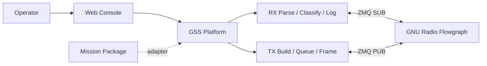
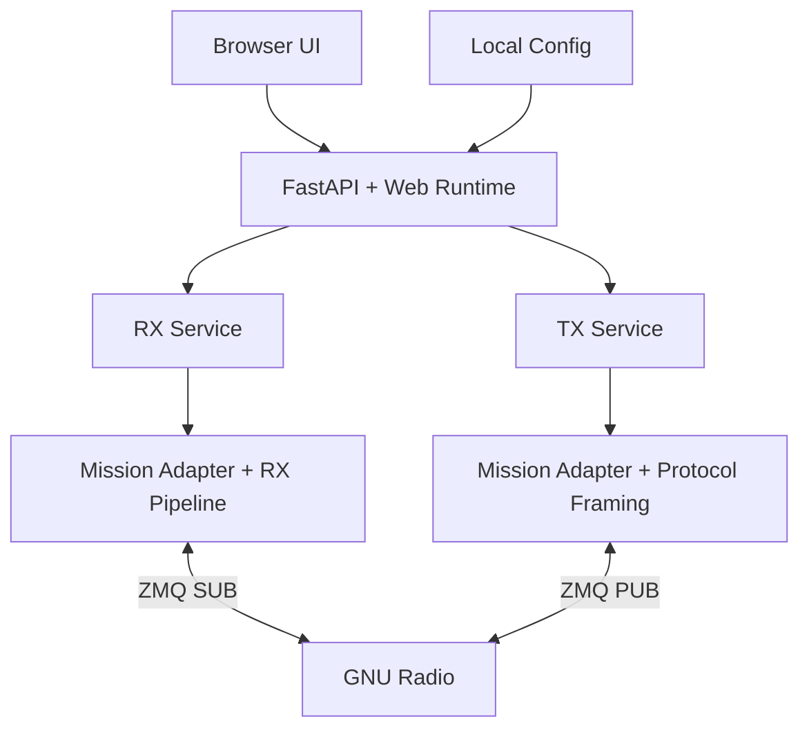

# MAVERIC Ground Station Software

MAVERIC GSS was originally built as the ground-station runtime for the **MAVERIC CubeSat** at the **University of Southern California (USC) Space Engineering Research Center (SERC)**. It has since evolved into a **multi-mission-capable ground station platform** — the core runtime, transport, logging, and UI are mission-agnostic, while mission-specific semantics (packet parsing, command encoding, operator rendering) live in pluggable mission packages.

MAVERIC is the first and primary mission package. New missions can be added under `mav_gss_lib/missions/<name>/` without changing platform code.

This repository is public-facing by design: the implementation is visible, the architecture is documented, and operationally sensitive mission-specific files stay local.

---

## Architecture

The platform sits between the operator and GNU Radio. It receives decoded traffic via ZMQ, passes it through a mission adapter for parsing and rendering, and exposes live state to browser clients over WebSocket. Outbound commands are built by the mission adapter, framed by the platform's protocol toolkit, and published to GNU Radio via ZMQ.



### Layers

1. **Browser UI** — React SPA for live RX/TX operations. Renders mission-provided structured data (columns, detail blocks, badges) generically.
2. **Web Runtime** — FastAPI backend: REST API, WebSocket endpoints, queue control, session management. Mission-agnostic — delegates semantics to the adapter.
3. **Shared Library** — Reusable protocol toolkit (AX.25, CSP, CRC, Golay, KISS), mission adapter loader, transport helpers, session logging.
4. **Mission Package** — Pluggable package owning all mission-specific semantics: packet parsing, command building, operator rendering, wire format, metadata.
5. **Radio Integration** — GNU Radio flowgraph connected via ZMQ PUB/SUB sockets.



---

## Boot Sequence

When `python3 MAV_WEB.py` runs:

1. `load_gss_config()` reads `mav_gss_lib/gss.yml` and merges with hardcoded defaults
2. `create_app()` instantiates `WebRuntime`:
   - Loads mission adapter via `load_mission_adapter(cfg)` — reads `mission.yml` or `mission.example.yml`, calls `init_mission()`, instantiates the adapter
   - Creates CSP/AX.25 protocol objects from merged config
   - Creates RX and TX services
3. FastAPI lifespan startup:
   - Loads persisted TX queue from `.pending_queue.jsonl`
   - Initializes ZMQ PUB socket for TX
   - Creates RX and TX session logs
   - Starts RX receiver thread (ZMQ SUB) and async broadcast loop
4. Uvicorn serves on `127.0.0.1:8080`, browser auto-opens

### GNU Radio Connection

The flowgraph must already be running before launching MAV_WEB. MAVERIC GSS connects to it via two ZMQ sockets:

| Direction | Socket | Default Address | Role |
|-----------|--------|-----------------|------|
| RX | ZMQ SUB | `tcp://127.0.0.1:52001` | Receives decoded PDUs from GNU Radio |
| TX | ZMQ PUB | `tcp://127.0.0.1:52002` | Publishes framed uplink payloads to GNU Radio |

Both addresses are configurable in `gss.yml`. PDUs use PMT serialization for GNU Radio interop.

---

## Required Local Files

These files are **gitignored** and must exist locally for the system to run:

| File | Location | Purpose |
|------|----------|---------|
| `gss.yml` | `mav_gss_lib/gss.yml` | Station config: ZMQ addresses, log directory, version |
| `commands.yml` | `mav_gss_lib/missions/maveric/commands.yml` | Command schema (gitignored for security) |
| `mission.yml` | `mav_gss_lib/missions/maveric/mission.yml` | Optional local/private mission metadata override |

Copy from examples to get started:

```bash
cp mav_gss_lib/gss.example.yml mav_gss_lib/gss.yml
```

The repository tracks `mission.example.yml` as the public-safe MAVERIC metadata baseline. If a local `mission.yml` exists beside it, the runtime prefers that local file.

The operational command schema (`commands.yml`) is gitignored for security. A public example (`commands.example.yml`) is tracked in each mission package — copy it to get started:

```bash
cp mav_gss_lib/missions/maveric/commands.example.yml mav_gss_lib/missions/maveric/commands.yml
```

Replace the example commands with your real mission commands for operational use.

If `gss.yml` is missing, the system falls back to hardcoded defaults. If `commands.yml` is missing, the system starts but cannot validate or send commands.

---

## Startup

### Running (no build step needed)

The production web UI (`mav_gss_lib/web/dist/`) is committed to the repo. To run:

```bash
conda activate gnuradio
cp mav_gss_lib/gss.example.yml mav_gss_lib/gss.yml   # first time only
python3 MAV_WEB.py
```

The web dashboard auto-opens at `http://127.0.0.1:8080`. The server shuts down 15 seconds after all browser tabs disconnect.

Either a `git clone` or a GitHub "Download ZIP" extract works as a starting point — on first launch from a zip, the updater prints `initializing git repository from zip extract (first launch)...` and bootstraps a real clone in place so the preflight Updates check and self-update flow stay functional.

### Web UI Development

For working on the frontend source (`mav_gss_lib/web/src/`):

```bash
cd mav_gss_lib/web
npm install            # first time only
npm run dev            # Vite dev server with HMR (proxies API to :8080)
npm run build          # production build to dist/ — commit after changes
```

The backend (`python3 MAV_WEB.py`) must be running alongside `npm run dev` for API/WebSocket proxying to work.

### Preflight Check

Before first launch, verify the environment:

```bash
python3 scripts/preflight.py
```

Reports pass/fail for Python dependencies, GNU Radio/PMT availability, config files, command schema, web build, and ZMQ addresses.
This includes the WebSocket backend required by Uvicorn for the browser RX/TX feeds.

### Self-Check

After starting the server, visit `/api/selfcheck` to verify the runtime environment:

```bash
curl http://127.0.0.1:8080/api/selfcheck
```

Reports active mission, resolved config/schema paths, web build status, and ZMQ endpoints.

---

## What It Delivers

### Live Downlink Operations

- Real-time packet visibility with parsed routing and command detail
- Duplicate detection and uplink-echo tagging
- Stale-link and health indicators
- Local RX session logging (JSONL + formatted text)

### Controlled Uplink Operations

- Raw CLI command input with mission-owned parsing and validation
- Optional visual command builder UI per mission (e.g. MAVERIC command picker)
- Persistent TX queue with drag-and-drop reorder
- Delay items and guard confirmations
- Two uplink modes: AX.25 (Mode 6) and ASM+Golay (Mode 5, recommended)
- Local TX session logging

### Operator Workflow

- Browser-based split RX/TX console
- Log replay and session review
- Runtime config editing
- Keyboard-driven controls (Ctrl+K command palette)

---

## Codebase Layout

```text
MAV_WEB.py                      Web runtime entrypoint

mav_gss_lib/
    config.py                   Config loader (gss.yml + defaults)
    mission_adapter.py          Mission adapter protocol + loader
    parsing.py                  RX pipeline: Packet dataclass, duplicate tracking
    logging.py                  Dual-output session logging (JSONL + text)
    transport.py                ZMQ PUB/SUB setup, PMT PDU helpers
    textutil.py                 Text formatting utilities

    protocols/
        ax25.py                 AX.25 HDLC framing (Mode 6)
        csp.py                  CSP v1 header build/parse, KISS framing
        crc.py                  CRC-16 XMODEM, CRC-32C
        golay.py                ASM+Golay framing (AX100 Mode 5)
        frame_detect.py         Frame type detection and normalization

    preflight.py                Local environment checks
    updater.py                  Runtime dependency bootstrap

    missions/
        template/               Minimal starter mission package
        maveric/
            __init__.py          Mission entry point (API version, init hook, plugin routers)
            adapter.py           MavericMissionAdapter (parse, render, encode)
            nodes.py             NodeTable dataclass + init_nodes factory
            wire_format.py       CommandFrame encode/decode
            schema.py            Command schema loading + validation
            cmd_parser.py        TX command line parser
            rx_ops.py            RX packet parsing operations
            tx_ops.py            TX command building operations
            rendering.py         RX display rendering (row, detail, protocol, integrity)
            log_format.py        Mission-specific log record formatting
            imaging.py           Image chunk reassembly + plugin REST router
            mission.example.yml  Tracked public-safe mission metadata baseline
            mission.yml          Optional local mission metadata override
            commands.example.yml Annotated command schema example
            commands.yml         Operational command schema (gitignored)

    web/
        package.json             Frontend dependencies and version
        src/                     React + Vite + Tailwind + shadcn/ui
        dist/                    Production build (committed)

    web_runtime/
        app.py                  FastAPI factory + lifespan (mounts plugin routers)
        state.py                WebRuntime container (SHUTDOWN_DELAY, preflight state)
        runtime.py              Send-context helpers
        api/                    REST API package (config, schema, logs, queue_io, session)
        rx.py                   /ws/rx WebSocket handler
        tx.py                   /ws/tx WebSocket handler
        rx_service.py           ZMQ SUB receiver + broadcast loop
        tx_service.py           TX queue, send loop, history, persistence
        tx_queue.py             Pure queue helpers (build, validate, persist, import)
        tx_actions.py           Queue mutation actions
        services.py             Re-export shim (back-compat)
        _broadcast.py           broadcast_safe helper
        session_ws.py           /ws/session handler
        preflight_ws.py         /ws/preflight handler + updater scheduling
        security.py             CORS/CSP middleware

tests/                          Test suite (pytest)
    echo_mission.py             Example non-MAVERIC adapter for testing
```

---

## Mission Adapter Boundary

The system is structured around a **mission adapter** that owns all mission-specific semantics:

- Frame classification and normalization
- Inner packet parsing (CSP, command wire format)
- Integrity checks (CRC-16, CRC-32C)
- Duplicate fingerprinting and uplink-echo classification
- TX command encoding and argument validation
- UI rendering: column definitions, detail blocks, protocol blocks
- Log serialization

The platform (transport, runtime, UI shell, logging) is mission-agnostic. The MAVERIC mission is implemented as one package under `mav_gss_lib/missions/maveric/`. A second adapter (`tests/echo_mission.py`) proves the boundary works.

For a future SERC mission:

1. Create a new mission package under `mav_gss_lib/missions/<name>/`
2. Provide `__init__.py` (with `ADAPTER_API_VERSION`, `ADAPTER_CLASS`, `init_mission`), `mission.example.yml`, `adapter.py`, and `commands.yml`
3. Set `general.mission` in `gss.yml` to the package name
4. Leave transport, runtime, logging, and UI code unchanged

Mission packages are discovered by convention — any package at `mav_gss_lib.missions.<name>` is automatically found. No platform registration needed.

See `mav_gss_lib/missions/template/` for a minimal starting point and `docs/maintainer_handoff.md` for the full contract.

---

## Testing

```bash
conda activate gnuradio
pytest -q
```

One end-to-end GNU Radio test is opt-in (requires full gr-satellites environment):

```bash
MAVERIC_FULL_GR=1 pytest -q -rs tests/test_ops_golay_path.py
```

---

## Public Repository Policy

**Tracked in git:**
source code, web UI, public-safe examples, documentation

**Kept local and untracked:**
`gss.yml`, `commands.yml`, logs, generated command files, `.pending_queue.jsonl`

---

## Documentation

- `docs/maintainer_handoff.md` — Boot path, required files, config structure, mission contract, adaptation guide
- `docs/adding-a-mission.md` — Guide for adding a new mission package
- `docs/plugin-system.md` — Mission plugin pages (standalone tools beyond core RX/TX)
- `docs/mission-help-contract.md` — Proposed contract for mission-owned operator help
