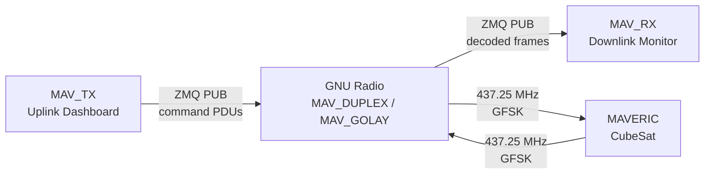
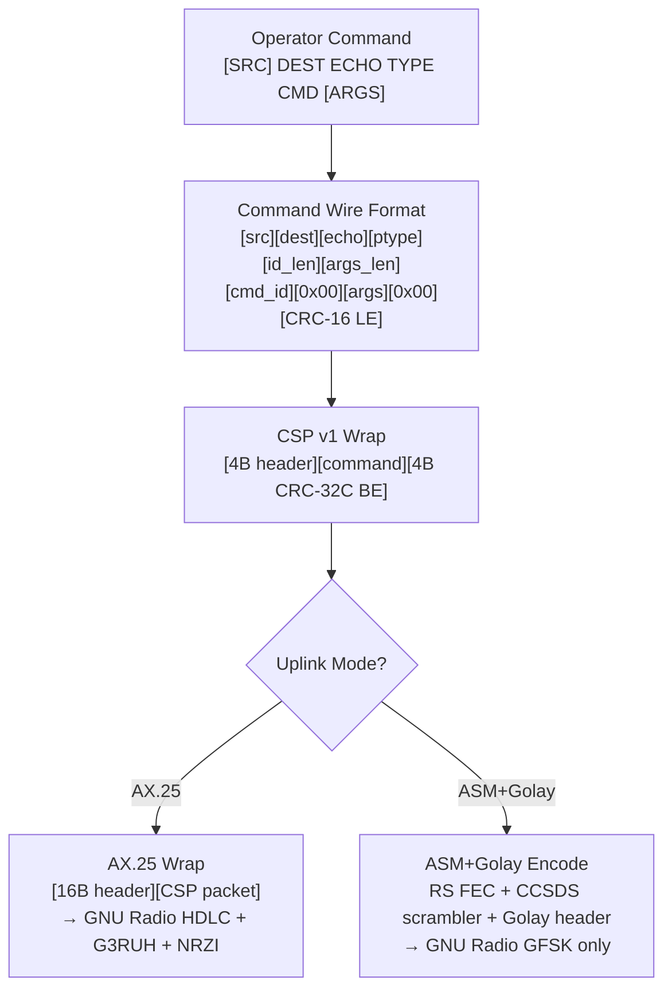

# MAVERIC Ground Station Software

Ground station suite for the MAVERIC CubeSat mission (USC ISI SERC). Provides simultaneous full-duplex uplink/downlink using a single USRP B210 with the GNU Radio MAV_DUPLEX flowgraph.



Supports two uplink modes:
- **AX.25 HDLC** (Mode 6) — HDLC framing, G3RUH scrambler, NRZI encoding (GNU Radio)
- **ASM+Golay** (Mode 5, recommended) — Reed-Solomon FEC, CCSDS scrambler, Golay-coded length. Verified uplink to MAVERIC AX100 hardware

## Quick Start

Requires the **radioconda** conda environment with GNU Radio 3.10+, gr-satellites, PyZMQ, pmt, crcmod, pyyaml, and textual.

```bash
conda activate gnuradio

# Start GNU Radio MAV_DUPLEX flowgraph first

python3 MAV_RX.py              # Downlink monitor
python3 MAV_TX.py              # Uplink dashboard
python3 MAV_RX.py --nosplash   # Skip splash screen
```

## Structure

```
MAV_RX.py                 Downlink packet monitor (Textual app)
MAV_TX.py                 Uplink command dashboard (Textual app)

mav_gss_lib/
    protocol.py           Nodes, CSP v1, AX.25, KISS, CRC-16/CRC-32C (crcmod), command wire format
    transport.py          ZMQ PUB/SUB, PMT PDU send/receive, socket monitoring
    config.py             YAML config loader/saver, AX.25/CSP command handlers
    parsing.py            RX packet processing pipeline (RxPipeline)
    logging.py            Session logging — JSONL + formatted text, background writer thread
    golay.py              ASM+Golay encoder: Golay(24,12), RS FEC (cached), CCSDS scrambler, frame assembly
    ax25.py               AX.25 HDLC encoder: fused HDLC+G3RUH+NRZI+pack single-pass pipeline
    tui_common.py         Shared Textual UI: ConfigScreen, ConfirmScreen, HelpPanel, SplashScreen, flash_phase, styles
    tui_rx.py             RX widgets: header, packet list (cached filter), packet detail
    tui_tx.py             TX widgets: header, queue, sent history, config fields

maveric_gss.yml           Shared config (nodes, AX.25, CSP, ZMQ, frequency)
maveric_decoder.yml       gr-satellites satellite definition
generated_commands/       Importable .jsonl command files (MAV_TX imp command)

start_rx_macos.command    macOS launcher for MAV_RX
start_tx_macos.command    macOS launcher for MAV_TX
start_rx_linux.sh         Linux launcher for MAV_RX
start_tx_linux.sh         Linux launcher for MAV_TX

logs/
    text/                 Human-readable logs (downlink_*.txt, uplink_*.txt)
    json/                 Machine-readable JSONL (downlink_*.jsonl, uplink_*.jsonl)
```

## Protocol Stack



### CSP v1 Header (32-bit big-endian)

```
Bit:  31  30  29    25  24    20  19      14  13     8  7        0
     ├────┤├───────┤├───────┤├─────────┤├────────┤├──────────────┤
     │Pri │  Src   │  Dest  │  DPort   │  SPort  │    Flags     │
     │ 2b │  5b    │  5b    │   6b     │   6b    │     8b       │
     └────┘└───────┘└───────┘└─────────┘└────────┘└──────────────┘
```

### AX.25 SSID Encoding

The GomSpace AX100 radio provides SSID values as raw hex bytes. The encoder accepts both formats:
- **0–15**: Standard SSID value, encoded as `0x60 | (ssid << 1) | ext_bit`
- **>15**: Raw SSID byte from AX100 config, placed directly with managed extension bit

## MAV_RX — Downlink Monitor

Subscribes to ZMQ where GNU Radio publishes decoded PDUs. A background thread receives packets into a queue; the Textual UI drains and displays them at 60Hz.

```
┌──────────────────────────────────────────────┐
│ MAVERIC DOWNLINK        2026-03-31 12:00:00 UTC │
│ ─────────────────────────────────────────────── │
│ ZMQ: tcp://... [ONLINE]  HEX:OFF  UL:HIDE  Q:0 │
├─────────────────────────────────────────────────┤
│ PACKETS (5)   Auto Scroll: ON                   │
│  #  TIME      FRAME  SRC → DEST  E:ECHO  TYPE  │
│  #1 12:00:00  AX.25  GS → EPS   E:UPPM  REQ   │
│  #2 12:00:01  AX.25  GS → EPS   E:UPPM  REQ   │
│ ...                                             │
│ ─────────────────────────────────────────────── │
│ ▸▸▸  Received                                   │
├─────────────────────────────────────────────────┤
│ PACKET #2 DETAIL  2026-03-31 12:00:01 UTC  PDT │
│ CMD ROUTE   Src:GS  Dest:EPS  Echo:UPPM  REQ   │
│ CMD ID      ping                                │
│ CRC-16      0xc315 [OK]                         │
├─────────────────────────────────────────────────┤
│ > _                                             │
│ Tab: focus | ↑↓: select | Enter: detail | help  │
└─────────────────────────────────────────────────┘
```

**Commands**: `help`, `cfg`, `hex`, `ul`, `wrapper`, `detail`, `live`, `hclear`, `tag <name>`, `log [name]`, `restart`, `q`

**Keys**: Up/Down (select packet), PgUp/PgDn (scroll), Shift+Down (jump to live), Enter (toggle detail), Tab (toggle focus), Ctrl+C (quit)

**Features**:
- Auto Scroll follows newest packets; selecting a packet exits auto mode
- Uplink echoes tagged `UL` (src=GS or dest/echo not addressed to GS)
- Duplicate detection via CRC-16 + CRC-32C fingerprint (tagged `DUP`)
- Unparseable signals shown as `UNKNOWN` with separate numbering
- Uplink echoes excluded from pkt/min rate
- Hex/ASCII display toggleable; ASCII always shown in detail
- `tag` renames current log files; `log` starts a new log session

## MAV_TX — Uplink Dashboard

Publishes command PDUs via ZMQ to the GNU Radio flowgraph. Commands are queued with optional delay and guard items, then sent asynchronously in a background thread. The queue renders bottom-up with the next-to-send command at the bottom.

```
┌──────────────────────────────────────────────┐
│ MAVERIC UPLINK          2026-03-31 12:00:00 UTC │
│ ─────────────────────────────────────────────── │
│ ZMQ: tcp://... [ONLINE]  Mode: ASM+GOLAY        │
├─────────────────────────────────────────────────┤
│ TX QUEUE (2)       Ctrl+S: send | Ctrl+X: clear │
│  ## DEST    E:ECHO  TYPE  CMD/ARGS         SIZE │
│                                                 │
│  #2 UPPM    E:UPPM  REQ   set_mode 5        15B │
│  ──────────────── 1.0s ─────────────────────    │
│  #1 EPS     E:UPPM  REQ   ping     NEXT     12B │
├─────────────────────────────────────────────────┤
│ SENT HISTORY (3)                                │
│  ## TIME     DEST    E:ECHO  TYPE  CMD/ARGS SIZE│
│  #1 12:00:00 EPS     E:UPPM  REQ   ping     20B │
│ ...                                             │
├─────────────────────────────────────────────────┤
│ SENT 1/2                                        │
│ > _                                             │
│ Tab: focus | Enter: queue | cfg | help | Ctrl+C │
└─────────────────────────────────────────────────┘
```

**Command format**: `CMD [ARGS]` (shorthand, uses schema defaults) or `[SRC] DEST ECHO TYPE CMD [ARGS]` (full form)

SRC defaults to GS. Examples:
```
ping                          # Shorthand (if schema has routing defaults)
set_voltage 3.3               # Shorthand with args
EPS UPPM REQ ping             # Full form
EPS 2 3 1 set_voltage 3.3     # Full form with numeric IDs
```

**Keys**: Ctrl+S (send queue — with confirmation), Ctrl+Z (undo last), Ctrl+X (clear queue — with confirmation), Up/Down (history recall), Tab (cycle focus), Ctrl+C/Esc (abort send or quit)

**Queue Focus Keys**: Up/Down (navigate items), Space (toggle guard on command), Enter (edit delay value), W (insert delay after selected), Delete/Backspace (remove selected item)

**Commands**: `send`, `undo`/`pop`, `clear`, `hclear`, `wait [ms]`, `cfg`, `help`, `nodes`, `csp`, `ax25`, `mode [AX.25|ASM+GOLAY]`, `imp [file]`, `raw <hex>`, `tag <name>`, `log [name]`, `restart`, `q`

**Features**:
- **Dual uplink mode**: AX.25 HDLC (Mode 6) or ASM+Golay (Mode 5), switchable via `mode` command or cfg panel — both verified against live AX100 hardware
- **Typed queue items**: commands and delay separators, with optional guard flag for per-command confirmation during send
- **Reversed queue display**: next-to-send at bottom with `NEXT` pill flag, new items added above
- **Interactive queue editing**: navigate, delete, insert delays, toggle guards, edit delay values — all from keyboard
- Queue persisted to `.pending_queue.jsonl`, restored on startup
- Import supports JSONL with `//` comments and hybrid array+dict format
- Async send with instant abort (Ctrl+C/Esc), uniform SENT/GUARD flash
- `tag` renames current log files; `log` starts a new log session
- Config changes saved to `maveric_gss.yml` on exit
- Commands validated against `maveric_commands.yml` schema

## Configuration

### Config Modal

Both apps open a config editor via the `cfg` command. The config screen is a modal overlay with keyboard navigation:

- **↑↓** select field, **Enter** edit (text), toggle (on/off), or cycle (mode), **Esc** close and save
- TX config: Uplink Mode (AX.25/ASM+Golay), AX.25 callsigns/SSIDs, CSP parameters, frequency, ZMQ address, TX delay
- RX config: hex display toggle, logging toggle

### maveric_gss.yml

Shared by both apps. TX persists runtime changes on exit.

```yaml
ax25:
  src_call: WM2XBB         # Ground station callsign
  src_ssid: 0x61            # Raw SSID byte (GomSpace AX100)
  dest_call: WS9XSW        # Satellite callsign
  dest_ssid: 0x60

csp:
  priority: 2
  source: 0                 # Ground station CSP address
  destination: 8            # Satellite CSP address
  dest_port: 24
  src_port: 0
  flags: 0

tx:
  zmq_addr: tcp://127.0.0.1:52002
  frequency: 437.6 MHz
  delay_ms: 1000            # Inter-packet delay for queue sends (ms)
  uplink_mode: AX.25        # or "ASM+Golay"

rx:
  zmq_addr: tcp://127.0.0.1:52001
```

### maveric_commands.yml

Defines argument schemas for known commands. Not tracked in git for security — a local `maveric_commands.yml` must be created in the project root before running. See the schema header comments in the file for format details. Supported types: `str`, `int`, `float`, `epoch_ms`, `bool`.

- **RX**: parses known commands by position and type (falls back to heuristic for unknown)
- **TX**: validates arguments before queuing; rejects invalid commands with specific errors

## Logging

Both sessions produce paired logs in `logs/text/` and `logs/json/`:

| File | Content |
|------|---------|
| `downlink_YYYYMMDD_HHMMSS.txt` | RX packets — CSP, command routing, CRC, hex dump, flags |
| `downlink_YYYYMMDD_HHMMSS.jsonl` | RX packets — machine-readable |
| `uplink_YYYYMMDD_HHMMSS.txt` | TX commands — routing, AX.25/CSP state, CRC, hex |
| `uplink_YYYYMMDD_HHMMSS.jsonl` | TX commands — machine-readable |

All file I/O runs on a background thread so the UI never blocks on disk writes. RX logging can be toggled at runtime. Use `tag <name>` to rename the current log files for easy identification, or `log [name]` to write a session summary and start a new log file pair.

## Decoder

`maveric_decoder.yml` configures gr-satellites with transmitter modes on 437.250 MHz:

- 19k2 FSK AX.25 G3RUH
- 4k8 FSK AX.25 G3RUH
- 4k8 FSK AX100 ASM+Golay
- 9k6 FSK AX100 ASM+Golay

## Dependencies

- [radioconda](https://github.com/ryanvolz/radioconda) (GNU Radio 3.10+, gr-satellites, PyZMQ, pmt)
- [Textual](https://textual.textualize.io/) (`pip install textual`)
- `crcmod` (`pip install crcmod`) — C-accelerated CRC-16/CRC-32C
- `pyyaml` (`pip install pyyaml`)
