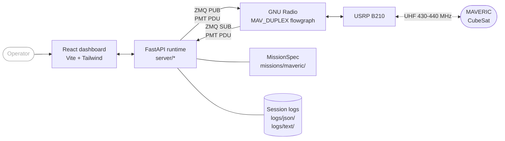
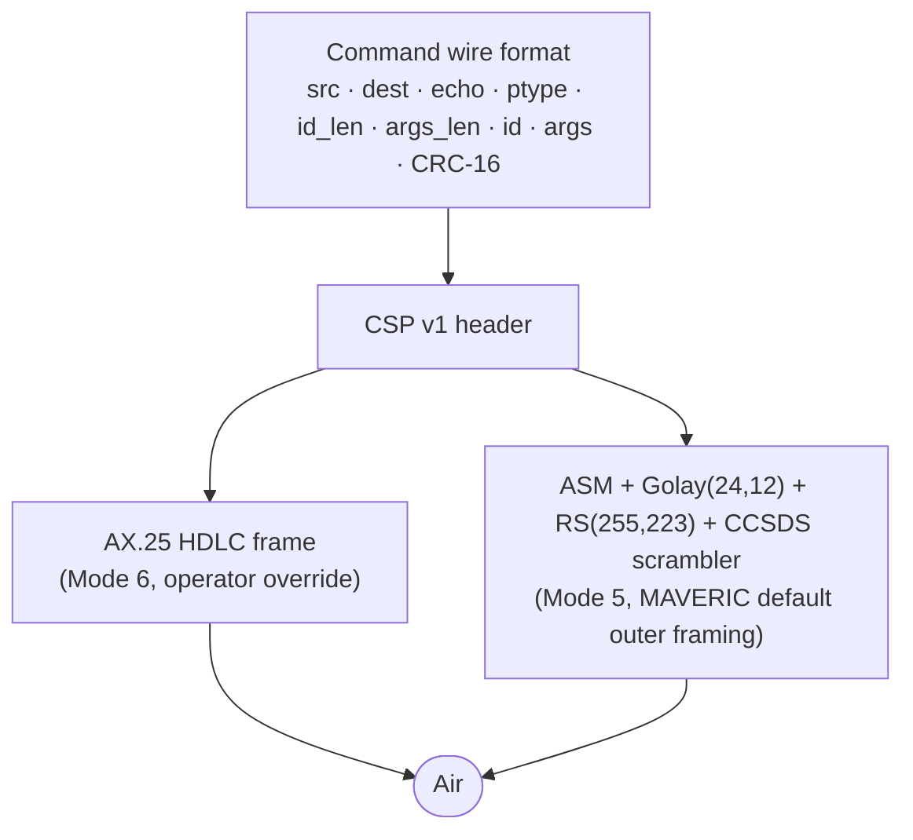

<div align="center">


# MAVERIC Ground Station Software

**Full-duplex-capable ground station for the MAVERIC CubeSat, built at USC SERC.**

[](mav_gss_lib/web/package.json)
[](requirements.txt)
[](https://www.gnuradio.org/)
[](mav_gss_lib/web/package.json)
[](https://fastapi.tiangolo.com/)
[](#protocol-stack)

[Quickstart](#quickstart) · [Features](#features) · [Architecture](#architecture) · [Documentation](#documentation) · [About MAVERIC](#about-maveric)


</div>

---

## Contents

- [Overview](#overview)
- [Features](#features)
- [Gallery](#gallery)
- [Quickstart](#quickstart)
- [Requirements](#requirements)
- [Run](#run)
- [Architecture](#architecture)
- [Protocol stack](#protocol-stack)
- [Uplink modes](#uplink-modes)
- [Repository layout](#repository-layout)
- [Configuration](#configuration)
- [Mission contract](#mission-contract)
- [Web UI development](#web-ui-development)
- [Testing](#testing)
- [Documentation](#documentation)
- [About MAVERIC](#about-maveric)
- [Citation](#citation)
- [Acknowledgements](#acknowledgements)

---

## Overview

MAVERIC GSS is the ground station software for the MAVERIC CubeSat mission, developed at the University of Southern California Space Engineering Research Center (SERC). The software and radio stack are full-duplex capable — a single USRP B210 driven by GNU Radio handles both uplink and downlink channels — and the operational ground station runs half-duplex over a single UHF antenna using a coax switch to alternate between transmit and receive. The platform presents a web-based operator console for command composition, live telemetry, imaging, and GNC monitoring.

The platform is mission-agnostic. Transport, queue, logging, protocol toolkit, and the web UI shell are reusable. Mission-specific parsing, command encoding, and operator rendering live in pluggable mission packages under `mav_gss_lib/missions/`. MAVERIC is the first and default mission package; additional missions drop in without platform changes.

## Features

- **Single-radio, full-duplex capable** — one USRP B210 drives both uplink and downlink channels via the `MAV_DUPLEX` GNU Radio flowgraph. The deployed station operates half-duplex over a single UHF antenna switched between TX and RX by a coax switch.
- **Two uplink framings** — `ASM+Golay` (Mode 5, CCSDS + Reed-Solomon FEC) is MAVERIC's default outer framing; `AX.25` (Mode 6, HDLC + G3RUH) is an operator-selectable override.
- **Mission-agnostic core** — swap the mission package to retarget the platform; a single `MissionSpec` contract (packets / commands / ui / telemetry / events / http / config) is enforced at load time.
- **Drag-to-reorder command queue** with delay and note items, JSONL import/export, guard confirmation, and persistent recovery after restart.
- **Live session logs** — dual JSONL and human-readable text, per-session files under `logs/json/` and `logs/text/`.
- **Session replay** — browse and re-play any past session in the Log Viewer.
- **Telemetry dashboards** — EPS, GNC, and spacecraft-state telemetry routed through the platform telemetry store with per-domain catalogs and staleness tracking.
- **Imaging plugin** — chunked downlink reassembly, thumbnail previews, and delete.
- **Plugin system** — mission packages can register their own FastAPI routers and React plugin pages.
- **NASA HFDS-compliant console** — minimum 11 px text, ≥3:1 contrast, color redundancy via icon and text, 3/4/5 Hz alarm flash rates.
- **Preflight screen** — dependencies, GNU Radio, config, web build, and ZMQ connectivity verified before operator launch.

## Gallery

<table>
<tr>
<td width="50%"><strong>Main dashboard</strong><br/><sub>TX uplink queue (left) + RX downlink stream (right)</sub><br/><br/></td>
<td width="50%"><strong>Log viewer</strong><br/><sub>Calendar, session list, filter, replay</sub><br/><br/></td>
</tr>
</table>

## Quickstart

```bash
conda activate                                                                     # radioconda base env
cp mav_gss_lib/gss.example.yml mav_gss_lib/gss.yml                                 # first run only
cp mav_gss_lib/missions/maveric/commands.example.yml mav_gss_lib/missions/maveric/commands.yml
python3 MAV_WEB.py
```

The dashboard opens in the default browser at `http://127.0.0.1:8080`. The server exits about two seconds after the last browser tab closes.

For live uplink and downlink, start the `MAV_DUPLEX` GNU Radio flowgraph before launching `MAV_WEB.py`.

## Requirements

| Component | Minimum | Recommended | Notes |
|---|---|---|---|
| OS | macOS or Linux | Linux x86_64 / arm64 | Tested on macOS 15 and Ubuntu 22.04 |
| Python | 3.10 | 3.11 | Provided by radioconda |
| GNU Radio | 3.10 | 3.10 with gr-satellites | Supplies `pmt` and the flowgraph runtime |
| Node.js | — | 20 LTS | Only needed when rebuilding the UI |
| Radio | — | Ettus USRP B210 | Required for live RF; simulation and replay do not need hardware |
| Browser | Any modern Chromium/Firefox | Chrome / Edge | The dashboard is pure SPA; no extensions needed |

Python packages (`requirements.txt`): `fastapi`, `uvicorn`, `websockets`, `PyYAML`, `pyzmq`, `crcmod`, `Pillow`. `pmt` is provided by the local GNU Radio install.

## Run

```bash
conda activate                     # radioconda base env
cp mav_gss_lib/gss.example.yml mav_gss_lib/gss.yml                                   # first run only
cp mav_gss_lib/missions/maveric/commands.example.yml mav_gss_lib/missions/maveric/commands.yml  # first run only
python3 MAV_WEB.py
```

`MAV_WEB.py` serves the dashboard on `http://127.0.0.1:8080` (constants in `mav_gss_lib/server/state.py`) and auto-opens the default browser. The server exits roughly two seconds after the last RX and TX WebSocket client disconnects (`SHUTDOWN_DELAY` in `mav_gss_lib/server/shutdown.py`).

The GNU Radio flowgraph must be running before launching `MAV_WEB.py`. The runtime connects to it with two ZMQ sockets:

| Direction | Socket  | Default address         | Role                                 |
|-----------|---------|-------------------------|--------------------------------------|
| RX        | ZMQ SUB | `tcp://127.0.0.1:52001` | Receives decoded PDUs from GNU Radio |
| TX        | ZMQ PUB | `tcp://127.0.0.1:52002` | Publishes framed uplink payloads     |

Both addresses are editable in `gss.yml`. PDUs use PMT serialization for GNU Radio interop.

A quick runtime probe once the server is up:

```bash
curl http://127.0.0.1:8080/api/selfcheck
```

A standalone pre-launch environment check is available at `scripts/preflight.py`:

```bash
python3 scripts/preflight.py
```

It reports pass/fail for Python dependencies, GNU Radio and PMT availability, config files, web build, and ZMQ addresses.

## Architecture

The platform sits between the operator and GNU Radio. RX traffic arrives as PMT-serialized PDUs over ZMQ SUB, runs through the active mission's `PacketOps` pipeline (normalize → parse → classify), and is broadcast to browser clients over `/ws/rx`. TX commands flow in the reverse direction: the UI submits payloads over `/ws/tx`, the mission's `CommandOps` parses / validates / encodes / frames them (CSP + AX.25 or ASM+Golay — mission-owned), and the platform publishes the framed bytes to GNU Radio over ZMQ PUB as-is.



Top-level platform modules:

| Module                           | Role                                                                 |
|----------------------------------|----------------------------------------------------------------------|
| `MAV_WEB.py`                     | Entrypoint. Bootstraps dependencies, builds the FastAPI app, runs Uvicorn. |
| `mav_gss_lib/config.py`          | Split-state loader (`load_split_config` → `(platform_cfg, mission_id, mission_cfg)`). Single-sources `general.version` from `mav_gss_lib/web/package.json`. |
| `mav_gss_lib/platform/`          | Platform API (`MissionSpec`, `MissionContext`, capability protocols, pipelines, `PlatformRuntime`, `load_mission_spec_from_split`). |
| `mav_gss_lib/protocols/`         | Framing toolkit (AX.25 / CSP / CRC / Golay / frame detect) — consumed only by mission packages. |
| `mav_gss_lib/transport.py`       | ZMQ PUB/SUB setup, PMT PDU send/receive, socket monitoring. |
| `mav_gss_lib/logging/`         | Dual-output session logging (JSONL + formatted text). |
| `mav_gss_lib/identity.py`        | Operator / host / station capture (`capture_operator`, `capture_host`, `capture_station`). |
| `mav_gss_lib/updater/`         | Runtime dependency bootstrap and self-update flow. |
| `mav_gss_lib/preflight.py`       | Environment-check backend used by `scripts/preflight.py` and the web preflight screen. |
| `mav_gss_lib/constants.py`       | Platform string constants (default mission, default ZMQ addresses). |
| `mav_gss_lib/textutil.py`        | Text formatting helpers. |

Web runtime (`mav_gss_lib/server/`):

| Module                | Role                                                                  |
|-----------------------|-----------------------------------------------------------------------|
| `app.py`              | FastAPI factory, lifespan, static mount, `MissionSpec.http` router mount. |
| `state.py`            | `WebRuntime` container (split config + `PlatformRuntime` + `MissionSpec`), `HOST`, `PORT`, `MAX_PACKETS`, `MAX_HISTORY`, `MAX_QUEUE`, `Session`. |
| `shutdown.py`         | `SHUTDOWN_DELAY`, delayed-shutdown task scheduling.                   |
| `rx/service.py`       | ZMQ SUB receiver thread and async broadcast loop; drives `platform.process_rx` and fans mission `EventOps` messages out on `/ws/rx`. |
| `tx/service.py`       | TX queue, send loop, history, persistence, guard confirmation; calls mission `CommandOps.frame(encoded)` for wire bytes. |
| `tx/queue.py`         | Pure queue helpers (build, validate, sanitize, save/load JSONL).      |
| `tx/actions.py`       | Queue mutation actions invoked by the `/ws/tx` handler.               |
| `ws/rx.py` / `ws/tx.py` | `/ws/rx` and `/ws/tx` WebSocket handlers.                           |
| `ws/session.py`       | `/ws/session` WebSocket.                                              |
| `ws/preflight.py`     | `/ws/preflight` WebSocket and preflight broadcast loop.               |
| `ws/update.py`        | Update-check scheduling and WebSocket.                                |
| `ws/_utils.py`        | Shared WebSocket helpers.                                             |
| `telemetry/`          | Platform telemetry router/state for mission-declared domains.         |
| `security.py`         | CORS / CSP headers / API-token check.                                 |
| `api/`                | REST routers: `config.py`, `schema.py`, `logs.py`, `queue_io.py`, `session.py`. |
| `_atomics.py`         | `AtomicStatus` primitive.                                             |
| `_broadcast.py`       | `broadcast_safe` WebSocket helper.                                    |
| `_task_utils.py`      | Task exception logging.                                               |

## Protocol stack

Frames layer outward from the command payload to the air interface:



Supported argument types in the command schema: `str`, `int`, `float`, `epoch_ms`, `bool`, `blob`. MAVERIC's default outer framing is **ASM+Golay (Mode 5)** — seeded from `missions/maveric/defaults.py::TX_DEFAULTS`. Switch to AX.25 by overriding `platform.tx.uplink_mode` in `gss.yml`.

## Uplink modes

| Property | `ASM+Golay` (Mode 5, default outer framing) | `AX.25` (Mode 6, override) |
|---|---|---|
| Encoding | NRZ, MSB first | NRZI, LSB first |
| Line coding | CCSDS scrambler | G3RUH scrambler |
| Framing | 32-bit ASM + Golay(24,12) length + RS(255,223) | HDLC flag + 16-byte AX.25 header |
| FEC | Reed-Solomon (corrects up to 16 byte errors per frame) | None |
| Approx throughput at 9k6 | 796 B/s | 985 B/s |
| Frame structure | `[50B preamble][4B ASM][3B Golay][scrambled RS codeword][pad to 255B]` | Variable |
| Payload limit (post-CSP) | 223 bytes | HDLC-bound |

Mode 5 is the default because its FEC materially improves pass yield at the cost of modest throughput.

## Repository layout

```text
MAV_WEB.py                          Web runtime entrypoint
requirements.txt                    Backend Python dependencies

mav_gss_lib/
    config.py                       Split-state config loader (load_split_config)
    constants.py                    Platform-wide constants
    identity.py                     Operator / host / station capture
    transport.py                    ZMQ PUB/SUB + PMT PDU
    preflight.py                    Shared preflight-check library
    textutil.py                     Text helpers
    gss.example.yml                 Public-safe station config template

    logging/                        Session logs (JSONL + text)
        _base.py                    _BaseLog — writer thread, rotation, banner
        session.py                  SessionLog (RX)
        tx.py                       TXLog (TX)

    updater/                        Self-updater + pre-import bootstrap
        bootstrap.py                bootstrap_dependencies (pre-FastAPI)
        check.py                    check_for_updates
        apply.py                    apply_update
        status.py                   UpdateStatus + Commit + Phase + exceptions
        _helpers.py                 git + subprocess helpers

    platform/                       Mission/platform boundary + runners
        runtime.py                  PlatformRuntime.from_split(...)
        loader.py                   load_mission_spec_from_split
        contract/                   What missions implement (Protocols + types)
            mission.py              MissionSpec, MissionContext, MissionConfigSpec
            ui.py                   UiOps
            http.py                 HttpOps
            packets.py              PacketOps + envelope types
            commands.py             CommandOps + draft/encoded/framed types
            telemetry.py            TelemetryOps + extractor/domain types
            events.py               EventOps + PacketEventSource
            rendering.py            Cell + ColumnDef + PacketRendering
        rx/                         Inbound runners
            packets.py              PacketPipeline
            telemetry.py            extract + ingest helpers
            events.py               collect_* event builders
            rendering.py            render_packet + fallback
            logging.py              rx_log_record + rx_log_text
            pipeline.py             RxPipeline + RxResult
        tx/                         Outbound runners
            commands.py             prepare_command + frame_command
            logging.py              tx_log_record
        config/                     Platform config-update boundary
            spec.py                 PlatformConfigSpec
            updates.py              apply_*_config_update + persist_mission_config
        telemetry/                  Runtime telemetry types
            fragment.py             TelemetryFragment
            policy.py               MergePolicy + lww_by_ts
            state.py                EntryLoader + DomainState
            router.py               TelemetryRouter

    protocols/                      Framing toolkit (consumed only by missions)
        ax25.py                     AX.25 HDLC framing (Mode 6)
        csp.py                      CSP v1 header + KISS framing
        crc.py                      CRC-16 XMODEM, CRC-32C
        golay.py                    ASM+Golay framing (Mode 5)
        frame_detect.py             Frame-type detection

    missions/
        maveric/                    MAVERIC mission package (production)
            mission.py              build(ctx) -> MissionSpec
            defaults.py             Seed constants + seed_mission_cfg
            config_access.py        mission_cfg read helpers
            nodes.py                NodeTable + init_nodes
            preflight.py            Mission preflight factory
            wire_format.py          CommandFrame encode/decode (shared RX+TX)
            schema.py               commands.yml loader + validator (shared)
            commands.example.yml    Tracked public-safe command schema
            rx/                     MavericPacketOps — ops/parser/packet
            commands/               MavericCommandOps — ops/parser/builder/framing
            ui/                     MavericUiOps — ops/rendering/formatters/log_format
            telemetry/              TelemetryOps — ops + extractors/ + semantics/
            imaging/                ImageAssembler + /api/plugins/imaging + EventOps
        echo_v2/                    Minimal fixture mission (round-trip echo)
        balloon_v2/                 Telemetry-only fixture mission

    server/                         FastAPI backend
        app.py                      create_app + lifespan
        state.py                    WebRuntime container
        shutdown.py, security.py    Lifecycle + auth middleware
        ws/                         All WebSocket handlers
            rx.py, tx.py, session.py, preflight.py, update.py
        rx/service.py               RX thread + broadcast loop
        tx/                         Service, queue, actions
        api/                        REST endpoints
        telemetry/api.py            /api/telemetry/{domain}/catalog

    web/                            React + Vite + TypeScript frontend
        src/                        UI source (components/, hooks/, state/, lib/, plugins/)
        dist/                       Production build (committed)
        package.json                Frontend deps + version (single source of truth)

tests/                              unittest suite
docs/                               Architecture + maintainer docs + images
scripts/
    preflight.py                    Standalone CLI preflight runner
    preview_eps_hk.py               EPS HK fixture preview script
tools/
    maveric_zmq_e2e_test.py         End-to-end ZMQ loopback test harness
```

## Configuration

Two config inputs drive the runtime:

- `mav_gss_lib/gss.yml` — operator station config in native split-state shape: ZMQ addresses, log directory, TX delay, uplink mode, station catalog, active mission id, and mission-editable overrides under `mission.config.*` (for MAVERIC: `ax25.*`, `csp.*`, `imaging.thumb_prefix`). Gitignored. Copy from `mav_gss_lib/gss.example.yml`. If the file is missing, the runtime falls back to built-in defaults.
- `mav_gss_lib/missions/<name>/commands.example.yml` — tracked, public-safe command schema template documenting `tx_args` and `rx_args`. The operational `commands.yml` is gitignored for security and must be supplied locally. Without it the server starts but cannot validate or send commands.

Mission identity constants (nodes, ptypes, mission name, UI titles, command schema filename) and mission-declared defaults live in each mission package's own code (e.g. `mav_gss_lib/missions/maveric/defaults.py`), seeded into `mission_cfg` by `build(ctx)` at startup. Operator values in `gss.yml` always win. There is no separate mission-metadata YAML file.

Version is single-sourced from `mav_gss_lib/web/package.json` via `config.py::_read_version()`. `gss.yml` cannot pin a version — the `/api/config` save path strips any client-supplied `general.version`.

Also gitignored: `logs/`, `images/`, `generated_commands/`, `.pending_queue.jsonl`, legacy telemetry snapshots such as `.gnc_snapshot.json`, and `node_modules/`. Current telemetry snapshots live under `<log_dir>/.telemetry/`.

## Mission contract

A mission is a Python package at `mav_gss_lib/missions/<name>/` exporting a top-level `mission.py` with:

```python
def build(ctx: MissionContext) -> MissionSpec: ...
```

`MissionContext` carries live references to `platform_config`, `mission_config`, and `data_dir`. `MissionSpec` bundles the mission's capabilities:

- `packets: PacketOps` — normalize → parse → classify (required).
- `ui: UiOps` — columns, row/detail rendering, log formatting (required).
- `config: MissionConfigSpec` — declares editable / protected `mission.config` paths (required).
- `commands: CommandOps` — parse → validate → encode → frame → render (optional; required for missions that transmit).
- `telemetry: TelemetryOps` — domains + extractors driving the platform telemetry router (optional).
- `events: EventOps` — per-packet side effects and replay-on-connect WS messages (optional).
- `http: HttpOps` — FastAPI routers auto-mounted at startup (optional).
- `preflight` — mission-specific preflight checks (optional).

Set `mission.id` in `gss.yml` to select the active package. The default is `maveric`; `echo_v2` and `balloon_v2` are fixture missions that exercise the boundary. See `docs/plugin-system.md` for the plugin side; `mav_gss_lib/platform/contract/mission.py` and the MAVERIC package are the authoritative reference for the contract.

## Web UI development

The production build at `mav_gss_lib/web/dist/` is committed so running the server does not require Node. When modifying UI source under `mav_gss_lib/web/src/`:

```bash
cd mav_gss_lib/web
npm install             # first time only
npm run dev             # Vite dev server with HMR, proxies API to :8080
npm run build           # production build; commit dist/ alongside source changes
```

The backend (`python3 MAV_WEB.py`) must be running while `npm run dev` is used so API and WebSocket requests can proxy to port 8080. Rebuild `dist/` and commit it whenever UI source changes so the served frontend stays in sync.

## Testing

The test suite under `tests/` runs under the radioconda environment. Run the whole suite with `unittest` discovery:

```bash
conda activate
python3 -m unittest discover -s tests -t . -v
```

Representative targeted runs by area:

```bash
python3 -m unittest tests.test_ops_protocol_core          # framing + CRC + KISS + CSP + AX.25 + Golay
python3 -m unittest tests.test_platform_architecture      # platform boundary guardrails (no runtime.cfg, no protocols under server)
python3 -m unittest tests.test_mission_owned_framing      # mission CommandOps.frame contract
python3 -m unittest tests.test_telemetry_router           # platform telemetry router + persistence + replay
python3 -m unittest tests.test_ops_server            # server wiring
python3 -m unittest tests.test_api_config_get_contract    # /api/config flat-projection contract
python3 -m unittest tests.test_identity                   # operator + host + station capture
```

Tests that require the full gr-satellites flowgraph are gated behind `MAVERIC_FULL_GR=1` and skip silently otherwise.

## Documentation

| Doc | Audience | What it covers |
|---|---|---|
| [`docs/user-guide.md`](docs/user-guide.md) | Operator | Pass-day walkthrough: setup, launch, UI, commanding, telemetry, logs, troubleshooting. |
| [`docs/mission-config-files.md`](docs/mission-config-files.md) | Operator | Placement of the two gitignored local files (`gss.yml`, `commands.yml`). |
| [`docs/plugin-system.md`](docs/plugin-system.md) | Mission author | Plugin pages, FastAPI routers, event sources, telemetry domains. |
| [`docs/adding-a-mission.md`](docs/adding-a-mission.md) | Mission author | Pointer to the `MissionSpec` contract sources. |
| [`docs/maintainer_handoff.md`](docs/maintainer_handoff.md) | Maintainer | Pointer to the runtime entry points and guardrail tests. |
| [`docs/telemetry-known-smells.md`](docs/telemetry-known-smells.md) | Maintainer | Known telemetry architecture tradeoffs and invariants. |

## About MAVERIC

MAVERIC is a science-and-technology CubeSat designed and built by students at the University of Southern California Space Engineering Research Center (SERC). It tests magnetics in orbit and carries two technology payloads demonstrating 2D and 3D visualization from an LCD screen for space applications.

- **Mission site:** <https://www.isi.edu/centers-serc/research/nanosatellites/maveric/>
- **Organization:** USC Space Engineering Research Center (SERC), Information Sciences Institute (ISI)

This repository is the operator-facing ground segment software — command entry, queueing, framing, transmission over a software-defined radio, and reception, decoding, logging, and display of downlink telemetry.

## Citation

If you use or reference this software in academic work, please cite:

```bibtex
@software{maveric_gss,
  title        = {MAVERIC Ground Station Software},
  author       = {Annuar, Irfan},
  organization = {USC Space Engineering Research Center, University of Southern California},
  year         = {2026},
  url          = {https://www.isi.edu/centers-serc/research/nanosatellites/maveric/}
}
```

## Acknowledgements

- [GNU Radio](https://www.gnuradio.org/) and the `gr-satellites` community for the RF signal chain.
- Ettus Research / NI for the [USRP B210](https://www.ettus.com/all-products/ub210-kit/).
- GomSpace for the [NanoCom AX100](https://gomspace.com/shop/subsystems/communication-systems/nanocom-ax100.aspx) transceiver specification used on orbit.
- The NASA Human Factors Design Standard (NASA-STD-3001 / HFDS) for operator-console guidance.
- The USC SERC MAVERIC team, past and present.
